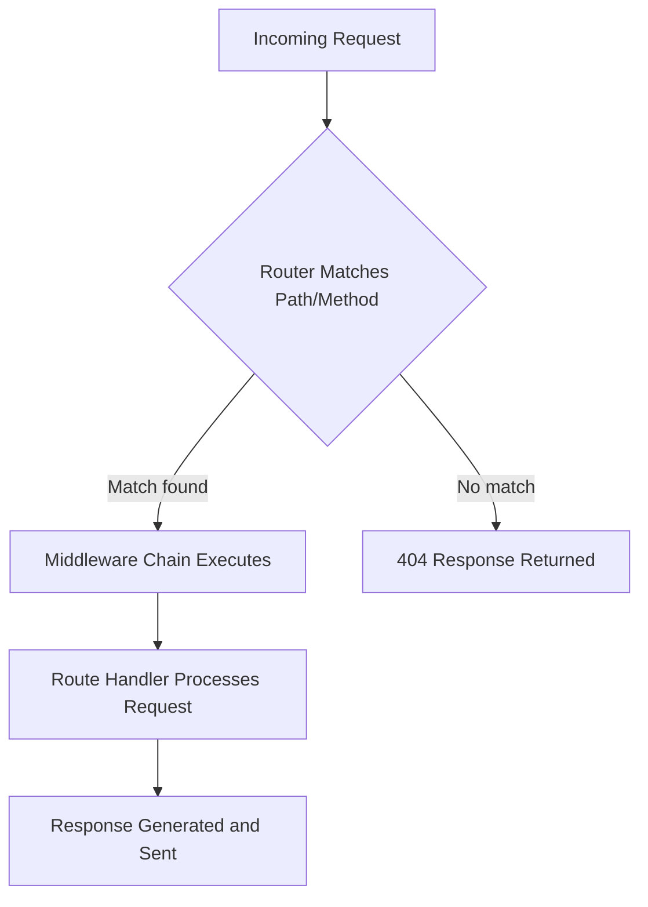

This section provides an overview of **Hono**, a lightweight and ultrafast web framework tailored for web developers creating high-performance APIs and web applications. **Hono** leverages web standards to deliver routing, middleware processing, and response rendering across multiple JavaScript runtimes, enabling seamless deployment without runtime-specific changes. It fits as the foundation for your entire application, powering everything from simple endpoints to complex services. For initial project setup, see [Getting Started](getting-started). Explore routing details in [Routing](routing), middleware options in [Middleware](middleware), and deployment adapters in [Runtime Adapters and Deployment](runtime-adapters-and-deployment).

## What You'll Find Here

**Hono** offers a streamlined environment for building web servers with minimal overhead. Key capabilities include matching incoming requests to specific paths and methods, applying layered processing steps (middleware), executing custom logic for each route, and generating responses like text, HTML, or streams. It supports quick project initialization and runs efficiently on edge and server environments, emphasizing speed, portability, and ease of use.

## Core Capabilities

### Request Processing Workflow
**Hono** handles incoming requests through a predictable flow, ensuring fast matching and execution:

This workflow allows developers to define paths, add processing layers, and return tailored outputs efficiently.

### Performance and Size Benefits
- **Ultrafast routing**: Uses optimized matching to avoid slow loops, handling high traffic with low latency.
- **Lightweight footprint**: Core preset under *12kB* with zero external dependencies, relying solely on web standards.
- **Multi-runtime support**: Deploy the same application unchanged across environments.

## Supported Runtimes

**Hono** applications run natively on various platforms without modifications.

| Runtime | Description | Common Use Cases |
|---------|-------------|------------------|
| **Cloudflare Workers** | Edge computing for global distribution. | Serverless APIs, static sites. |
| **Cloudflare Pages** | Full-stack hosting with functions. | Jamstack apps. |
| **Fastly Compute** | High-performance edge platform. | Real-time services. |
| **Deno** | Secure runtime with TypeScript support. | Scripts, APIs. |
| **Bun** | Fast all-in-one toolkit. | Development and production servers. |
| **Node.js** | Traditional server environment. | Legacy integrations. |
| **Vercel** | Serverless functions. | Frontend backends. |
| **AWS Lambda** | Event-driven compute. | Scalable workloads. |
| **AWS Lambda@Edge** | Edge-optimized functions. | CDN integrations. |

## Quick Project Initialization

1. Open your terminal in the desired project directory.
2. Run the creation command using your package manager (e.g., *npm create hono@latest*).
3. Follow the interactive prompts to select runtime, features, and template.
4. Navigate into the generated project folder.
5. Install dependencies as prompted.
6. Start the development server to see your app running.

> [!NOTE]  
> The initializer sets up a ready-to-run application with example routes and middleware, allowing immediate testing and customization.

## Built-in Features

**Hono** includes ready-to-use components for common needs:

| Feature Group | Examples | Purpose |
|---------------|----------|---------|
| **Routing** | Path matching, parameters. | Direct requests to handlers. See [Routing](routing). |
| **Middleware** | Security (auth, CORS), performance (cache, compress). | Add cross-cutting logic. See [Middleware](middleware). |
| **Rendering** | Text, HTML, JSX, streaming. | Generate dynamic responses. See [Rendering Responses](rendering-responses). |
| **Utilities** | Cookies, validation, static files. | Handle inputs and assets. See [Utilities and Validation](utilities-and-validation). |
| **WebSockets** | Real-time connections. | Bidirectional communication. See [WebSockets](websockets). |

## Summary
- **Hono** is an ultrafast, portable web framework for building APIs and apps on any JavaScript runtime, with core strengths in routing, middleware, and rendering.
- Start quickly with the project initializer and scale to production across edge/server platforms.
- Customize via built-in features like security middleware and JSX support.
- For hands-on setup, see [Getting Started](getting-started); dive into routes with [Routing](routing); optimize deployments via [Runtime Adapters and Deployment](runtime-adapters-and-deployment).