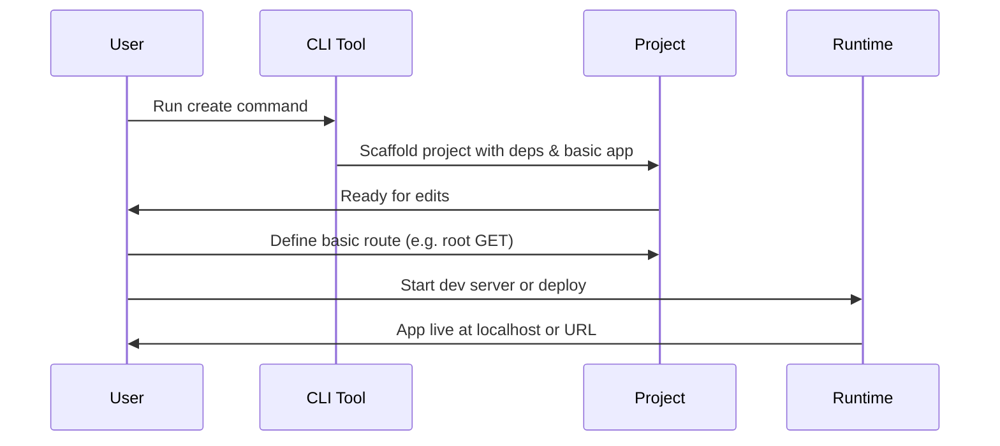

This section covers the Getting Started process, designed for new users building their first web application with Hono. It walks through project scaffolding, setting up a basic app, and running it locally or on a supported runtime, serving as the foundation before advancing to [Routing](routing), [Middleware](middleware), [Rendering Responses](rendering-responses), and [Runtime Adapters and Deployment](runtime-adapters-and-deployment). For a high-level product overview, see [Overview](overview).

## Overview
The Getting Started workflow enables rapid setup of a Hono project using a simple command-line tool, creation of a minimal functional app with routes and responses, and execution across multiple JavaScript runtimes. Key capabilities include one-command project generation, instant "Hello World" app readiness, and seamless local preview or runtime deployment.

## Supported Runtimes
Hono runs identically across these environments without code changes.

| Runtime            | Description |
|--------------------|-------------|
| Cloudflare Workers | Edge computing platform |
| Fastly Compute     | Edge compute service |
| Deno               | Secure runtime |
| Bun                | Fast all-in-one toolkit |
| Vercel             | Serverless platform |
| AWS Lambda         | Serverless compute |
| AWS Lambda@Edge    | Edge-optimized Lambda |
| Node.js            | Traditional server runtime |

For deployment details, see [Runtime Adapters and Deployment](runtime-adapters-and-deployment).

## Project Setup
1. Open your terminal or command prompt.
2. Run the **npm create hono@latest** command, optionally followed by your desired *project-name* (e.g., **npm create hono@latest my-app**).  
   > [!NOTE] If no name is provided, the tool prompts for one.
3. Navigate into the new project directory using **cd *project-name***.
4. The scaffold automatically handles dependency installation, creating a ready-to-run structure with a basic app example.

The resulting project includes a **package.json** with scripts for development and build, plus all necessary files for a minimal app.

## Basic Application
The scaffolded project comes with a pre-configured basic application featuring a Hono app instance and a simple root route returning text output.

To customize or verify:
1. Locate the main application file in your project (typically under a **src** folder).
2. Ensure it defines a Hono app instance.
3. Add or modify a **GET** route for the **/** path to return *Hono!* or custom text.
4. Save changes—the app is now ready to respond to requests.

| Route Element | Required | Accepted Values | Description |
|---------------|----------|-----------------|-------------|
| HTTP Method   | Yes     | *GET*, *POST*, etc. | Specifies the request type handled (e.g., **GET** for retrieval). |
| Path          | Yes     | */*, */users*, etc. | URL pattern to match (root **/** for home page). |
| Response      | Yes     | Text, JSON, HTML | Output sent to browser (e.g., plain *Hono!* text). |

> [!NOTE] Changes take effect immediately on restart of the dev server. For more routes, see [Routing](routing).

## Running the App
### Local Development
1. In the project directory, run the **dev** script via your package manager: **npm run dev**, **bun dev**, or equivalent.
2. The app starts a local server, typically accessible at *http://localhost:3000* or *http://localhost:8787*.
3. Open the URL in your browser to see the basic response (e.g., *Hono!*).
4. Make edits to routes or responses, save, and refresh—the dev server auto-reloads.

### Runtime Deployment
Export the app and use runtime-specific tools:
1. Follow runtime setup (e.g., **wrangler dev** for Cloudflare).
2. Deploy via **npm run deploy** or platform CLI.
3. Access via the provided public URL.

> [!WARNING] Stop the dev server with **Ctrl+C** to avoid port conflicts.

For runtime-specific commands, see [Runtime Adapters and Deployment](runtime-adapters-and-deployment).

## Summary
- Use **npm create hono@latest** for instant project scaffolding with dependencies.
- Customize the basic app by defining routes like root **GET** for simple text responses.
- Run locally with **npm run dev** and view at *localhost*; deploy to any supported runtime.
- Explore next: [Project Setup](project-setup) details, [Basic Application](basic-application) extensions via [Routing](routing), and full runtime options in [Runtime Adapters and Deployment](runtime-adapters-and-deployment).