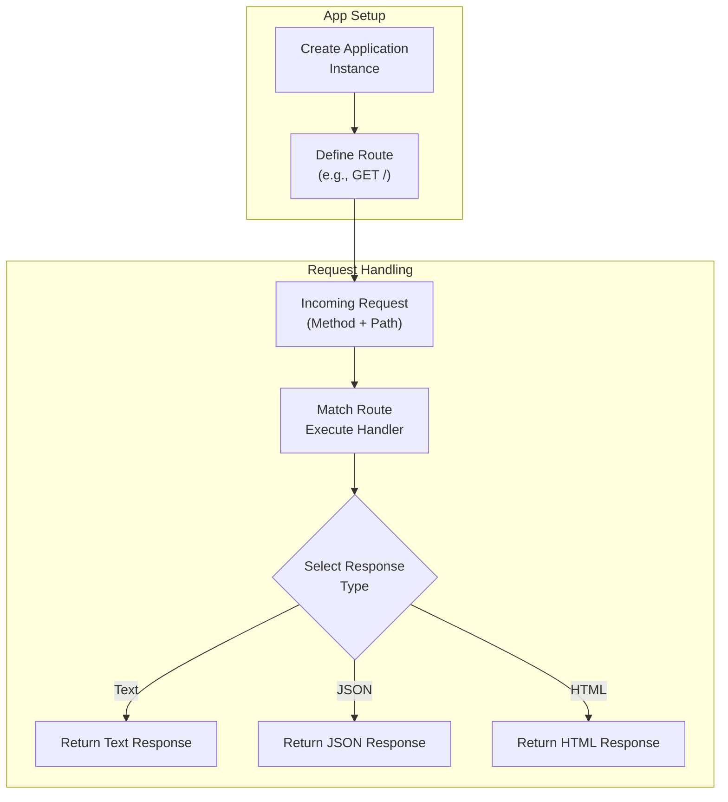

This section covers creating the core **Application** instance, defining your first routes, and handling basic requests and responses. It's designed for users who have completed 2.1. Project Setup and want to build their initial web app structure before 2.3. Running the App. This forms the foundation for more advanced routing in 3. Routing, middleware in 4. Middleware, and response rendering in 5. Rendering Responses.

## Overview
The **Application** serves as the central hub for your web app, where you register routes and define how incoming requests are processed to generate outgoing responses. It supports simple handlers that respond with text, JSON, or HTML, enabling quick setup of endpoints like a root path (`/`) that greets visitors.

## Creating the Application Instance
Start by initializing the **Application**, which becomes the main container for all your app's routes and logic. Once created:

- It prepares to listen for HTTP requests across supported runtimes.
- You can export it directly for deployment or further configuration.

This instance is lightweight and runtime-agnostic, working seamlessly in environments covered in 8. Runtime Adapters and Deployment.

## Defining Your First Route
Routes map incoming HTTP methods (like **GET**) and paths to specific handlers. For a basic app:

1. Define a route for the root path (`/`).
2. Associate it with a **GET** method.
3. Specify a handler that processes the request and returns a response.

This setup handles visitor requests to your app's homepage immediately.

> [!NOTE]  
> Begin with simple paths like `/` before exploring parametric or nested routes in 3.1. Basic and Parametric Routes.

## Handling Requests and Responses
Handlers receive details about the incoming request (such as path, headers, and body) and produce a response. Common response types include plain text for simple messages, JSON for data exchange, and HTML for rendered pages.

| Response Type | Description | Typical Use Case |
|---------------|-------------|------------------|
| **Text** | Sends a plain string response with `text/plain` content type. | Simple messages, status updates, or API acknowledgments (e.g., "Hello, World!"). |
| **JSON** | Sends structured data as JSON with `application/json` content type. | Returning objects, arrays, or API payloads. |
| **HTML** | Sends markup as HTML with `text/html` content type. | Rendering web pages or fragments. |

To use these:

1. In your route handler, select the response type based on the desired output.
2. Provide the content (e.g., a string for text, an object for JSON).
3. The system automatically sets headers and serializes as needed.

Responses are ultrafast and standards-compliant, supporting streaming for larger payloads as detailed in 5.2. Streaming Responses.

## Basic Workflow

## Summary
- Create a central **Application** instance to manage your web app.
- Define routes with HTTP methods and paths, starting with **GET /** for basics.
- Use text, JSON, or HTML responses in handlers for flexible outputs.
- This setup integrates with 2.3. Running the App for testing and 3. Routing for expansion.

For request parsing details, see 9.1. Request Parsing and Cookies. Explore middleware next in 4.1. Security and Auth Middleware.