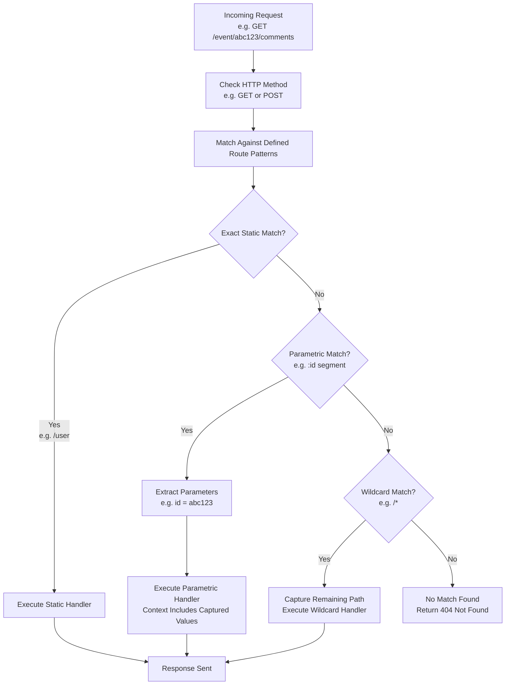

This section covers Basic and Parametric Routes, enabling you to handle incoming web requests by matching exact URL paths, dynamic segments with named parameters, and wildcards in your application. It's designed for developers building web apps and APIs, forming the foundation of request routing. For initial app setup, see [Basic Application](basic-application) and [Running the App](running-the-app). For advanced organization, see [Route Groups and Nesting](route-groups-and-nesting). Related features include request data access in [Request Parsing and Cookies](request-parsing-and-cookies).

## Overview
Basic and Parametric Routes let you define patterns that the system matches against incoming requests based on the HTTP method (such as **GET** or **POST**) and URL path. Exact paths handle static endpoints like user listings or status checks. Parametric routes capture variable segments (e.g., user IDs or emails) from the path, making them available in the request context for use in handlers. Wildcards catch remaining path segments for flexible matching, such as serving static files. Matching prioritizes the most specific pattern, with captured values provided directly in the context.

> [!NOTE]  
> Route patterns support deep nesting, like **/very/deeply/nested/route/hello/there**, for complex URL structures.

## Static Routes
Static routes match exact paths without variables, ideal for fixed endpoints.

Common examples include:
- **GET /user**: Lists users.
- **GET /user/comments**: Retrieves user comments.
- **GET /user/avatar**: Fetches user avatars.
- **POST /status**: Updates or checks status.
- **GET /very/deeply/nested/route/hello/there**: Handles deeply nested static paths.

When a request exactly matches the path and method, the associated handler executes.

## Parametric Routes
Parametric routes use **:name** syntax to capture dynamic values from path segments. The captured value becomes available in the request context under the **name** key.

| Route Pattern | HTTP Method | Example Request Path | Captured Values in Context |
|---------------|-------------|----------------------|----------------------------|
| /user/lookup/email/:address | GET | /user/lookup/email/user@example.com | *address*: *user@example.com* |
| /user/lookup/username/:username | GET | /user/lookup/username/john | *username*: *john* |
| /event/:id | GET | /event/abc123 | *id*: *abc123* |
| /event/:id/comments | GET | /event/abc123/comments | *id*: *abc123* |
| /event/:id/comments | POST | /event/abc123/comments | *id*: *abc123* |

Multiple parameters work in sequence or nested paths. For instance, a request to **/event/abc123/comments** extracts the **id** value for use in listing or creating comments.

## Wildcard Routes
Wildcard routes use ***** to match zero or more remaining path segments, useful for static assets or catch-all handling.

Example:
- Pattern: **/static/***
- Request: **/static/index.html**
- Captured: Remaining path (*index.html*) available in context as a wildcard value.

## Request Matching Workflow
The system processes incoming requests through this matching flow:

## Parameter Types
Routes primarily capture path parameters, with query parameters (from **?key=value**) available separately in the request context.

| Parameter Type | Location | Example | Context Availability | Description |
|----------------|----------|---------|----------------------|-------------|
| Path | URL segment | /user/:id with /user/123 | Keyed by *id* | Captures named segment value; required for dynamic routing. |
| Query | After **?** in URL | /user?id=123 | Keyed by *id* | Optional values from query string; multiple values possible (e.g., **?id=123&sort=asc**). |
| Wildcard | Remaining path | /files/* with /files/dir/file.txt | Wildcard key or splat | Catches trailing segments; useful for file serving. |

> [!WARNING]  
> Ambiguous patterns (e.g., /user/:id vs. /user/new) match the first defined; order routes from specific to general during setup.

## Summary
- Define **static routes** for exact path matching (e.g., **/user**, **/status**) across **GET** and **POST** methods.
- Use **:name** for parametric routes to capture and access dynamic values like IDs or usernames in context (e.g., **/event/:id/comments**).
- Employ ***** wildcards for flexible catch-all paths like static file serving.
- Follow the matching workflow: method check → pattern match → parameter extraction → handler execution.
For route organization, see [Route Groups and Nesting](route-groups-and-nesting). Access full request data in [Request Parsing and Cookies](request-parsing-and-cookies). Integrate with rendering in [JSX and DOM Rendering](jsx-and-dom-rendering) or middleware in [Security and Auth Middleware](security-and-auth-middleware).