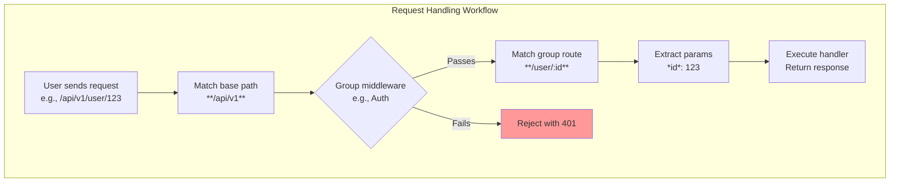

This section covers **Route Groups and Nesting**, features that let you organize related routes into logical sub-applications sharing a common base path and middleware. These are ideal for building scalable applications with structured endpoints, such as grouping all user-related paths under **/api/users** or event paths under **/events**. They build on basic routing from 3.1. Basic and Parametric Routes and integrate seamlessly with middleware from 4. Middleware, allowing shared behaviors like authentication across a group. For full application setup, see 2. Getting Started.

## Overview
Route groups and nesting help manage complexity in larger applications by prefixing multiple routes with a shared path segment and applying common middleware to the entire group. Nesting supports hierarchical paths with parameters that propagate through levels, while groups act like mini-applications mounted under a base path. This results in cleaner organization, easier maintenance, and targeted middleware application—such as requiring login only for **/user** endpoints.

Key capabilities:
- Define deeply nested paths like **/user/:id/comments** where **:id** is available throughout.
- Bundle routes into groups, e.g., all **/api/v1/user** routes sharing authentication middleware.
- Mount groups to create sub-apps, automatically handling path matching and parameter extraction.

## Route Nesting
Nesting organizes routes hierarchically, allowing parameters from parent paths to be accessible in child routes. When a request matches a nested path, the system extracts all parameters along the hierarchy and makes them available for use in handlers.

### Matching Nested Paths
Requests are matched against the full path string. For example:
- A request to **/user/123/comments** matches the **/user/:id/comments** route, providing *id* as **123**.
- Deep nesting like **/very/deeply/nested/route/hello/there** works without limits on depth.

| Example Path Pattern | Matches | Extracted Parameters | Description |
|----------------------|---------|----------------------|-------------|
| **/user** | **/user** | None | Basic user overview. |
| **/user/comments** | **/user/comments** | None | Lists user comments. |
| **/user/:id** | **/user/123** | *id*: **123** | Specific user details. |
| **/user/:id/comments** | **/user/123/comments** | *id*: **123** | Comments for user **123**. |
| **/event/:id/comments** | **/event/abc/comments** | *id*: **abc** | Comments for event **abc** (GET or POST). |
| **/user/lookup/username/:username** | **/user/lookup/username/alice** | *username*: **alice** | Lookup by username. |

> [!NOTE] Parameters like **:id** or **:username** are required and must match the path segment; invalid formats fall back to 404 responses.

## Route Groups
Route groups bundle related routes under a shared base path, treating them as a sub-application. Middleware applied to the group affects all routes within it, streamlining security or logging for sections of your app.

### Creating and Mounting Groups
1. Define a group with a base path, such as **/api/v1**.
2. Add routes to the group relative to the base (e.g., **users** becomes **/api/v1/users**).
3. Mount the group to your main application.
4. Optionally, assign middleware to the group, which runs before any matching route in the group.

Once mounted, requests to the group's paths are handled as if they were top-level, with parameters and middleware scoped to the group.

| Group Base Path | Included Routes | Applied Middleware Example | Resulting Full Paths |
|-----------------|-----------------|----------------------------|----------------------|
| **/user** | **/**, **/comments**, **/avatar**, **/lookup/username/:username** | Authentication | **/user**, **/user/comments**, **/user/123/avatar**, **/user/lookup/username/alice** |
| **/event** | **/:id**, **/:id/comments** (GET/POST) | Rate limiting | **/event/abc**, **/event/abc/comments** |
| **/api** | **/status** (POST) | Logging | **/api/status** |

> [!WARNING] Mounting overlapping groups (e.g., **/user** and **/user/:id**) follows first-match order; test thoroughly to avoid unintended routing.

## Configuration Options
Use these settings when defining groups to control behavior.

| Setting | Default | Options | What It Controls |
|---------|---------|---------|------------------|
| **Base Path** | None (required) | Any path string, e.g., **/api/v1** | Prefix applied to all routes in the group. |
| **Middleware Scope** | None | Per-group or per-route | Applies handlers like auth or CORS to the entire group before route matching. |
| **Parameter Inheritance** | Enabled | Enabled/Disabled | Allows parent path params (e.g., **:id**) to be used in nested child routes. |
| **Mount Order** | Declaration order | Custom sequence | Determines match priority for overlapping paths. |

For middleware details, see 4.1. Security and Auth Middleware and 4.2. Performance Middleware.

## Summary
- Organize hierarchical paths with nesting for clean, parameter-aware matching, as in **/event/:id/comments**.
- Use route groups to prefix sub-apps (e.g., **/api/users**) and share middleware across them.
- Follow the request workflow: base path match → middleware → route handler → response.
- Test deeply nested or grouped paths to ensure parameter extraction and order.

Related: 3.1. Basic and Parametric Routes for path fundamentals, 4. Middleware for group enhancements, 2.2. Basic Application for initial setup.