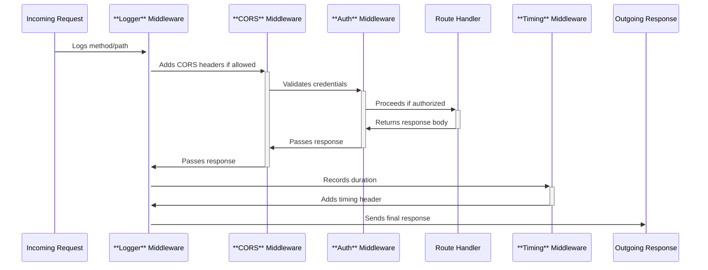

This section covers **Middleware**, reusable components that process incoming requests before they reach your route handlers and modify outgoing responses afterward. It's designed for developers building web applications who need to handle common tasks like enabling cross-origin requests, logging activity, optimizing performance through compression, and chaining multiple functions for complex logic. Middleware integrates into the request pipeline right after [Routing](routing) (3.1 Basic and Parametric Routes, 3.2 Route Groups and Nesting) and before [Rendering Responses](rendering-responses) (5). For specialized types, see [Security and Auth Middleware](security-and-auth-middleware) (4.1) and [Performance Middleware](performance-middleware) (4.2).

## Overview
Middleware provides a way to inject functionality across your application without repeating code in every route. Users apply it globally (to all routes), to specific paths or groups, or in sequences where each step passes control to the next using a **next** action. Common capabilities include adding security headers, recording request details for debugging, reducing response sizes, and measuring performance. When active, middleware visibly affects browser behavior (e.g., successful cross-origin fetches), console output (e.g., request logs), and network payloads (e.g., smaller gzipped responses).

## Request Flow Through Middleware
Middleware executes in the order you specify, processing the request inbound and the response outbound. The diagram below shows a typical chain:

> [!NOTE]  
> Each middleware must invoke **next** to continue the chain; skipping it halts processing and returns early.

## Built-in Middleware Types
The following table lists key built-in middleware, their purposes, and observable effects:

| Middleware Type | Purpose | Observable Effects |
|-----------------|---------|--------------------|
| **Logger** | Records incoming requests and responses | Console entries like "*GET /user 200 15ms*" appear for each request |
| **CORS** | Enables browsers to make requests from different origins | Browser console shows no CORS errors; **Access-Control-Allow-Origin** header in responses |
| **Compression** (e.g., Gzip) | Reduces response body size | Network tab shows *gzip* encoding; smaller transfer sizes (e.g., 5KB → 1KB) |
| **Timing** | Measures request processing duration | **X-Response-Time** header (e.g., *25ms*) added to responses |
| **Basic Auth** | Restricts access via username/password | 401 *Unauthorized* response without valid **Authorization: Basic** header |
| **JWT** | Validates bearer tokens for authentication | Proceeds only if token in **Authorization: Bearer** header is valid; otherwise 401 |

## Applying Middleware
Follow these steps to add middleware to your application:

1. Decide the scope: global (all routes), path-specific (e.g., **/api/**), or route-grouped (see [Route Groups and Nesting](route-groups-and-nesting)).
2. Select the middleware type based on needs (e.g., **CORS** for frontend APIs).
3. Configure options via a settings object (detailed below).
4. Position it before your route handlers; chain multiple by listing in sequence.
5. Test by sending requests: observe logs, headers, or errors in browser dev tools or console.

For custom chains:
1. List middleware in desired order (inbound: logger → CORS → auth).
2. Ensure each calls **next** to pass to the next.
3. Add outbound middleware (e.g., timing) after handlers.

> [!WARNING]  
> Applying auth or security middleware without proper credentials blocks all downstream routes—test with valid inputs first.

## Configuration and Settings
Use the table below for user-configurable options across middleware types. Provide values when applying (e.g., as an object with labeled fields).

| Setting | Default | Options/Accepted Values | What It Controls |
|---------|---------|-------------------------|------------------|
| **origin** (**CORS**) | *"* (all origins) | Specific domains (e.g., *https://example.com*), array of domains, *null* | Allowed requesting origins; restricts cross-origin access |
| **credentials** (**CORS**) | *false* | *true*/*false* | Whether to include cookies/credentials in cross-origin requests |
| **methods** (**CORS**) | *GET, POST* | Comma-separated HTTP methods (e.g., *GET, POST, PUT*) | Allowed HTTP methods in preflight responses |
| **logger** (**Logger**) | Console output | Custom logger object with *info*, *warn* methods | Destination/format of log messages (e.g., file, service) |
| **level** (**Logger**) | *info* | *debug*, *info*, *warn*, *error* | Verbosity of logs (e.g., *debug* includes headers/body) |
| **threshold** (**Compression**) | 1024 bytes | Number (bytes), *0* (always compress) | Minimum response size to trigger compression |
| **username** (**Basic Auth**) | N/A | String (required) | Expected username in **Authorization** header |
| **password** (**Basic Auth**) | N/A | String (required) | Expected password (hashed or plain) |
| **secret** (**JWT**) | N/A | String (required) | Key to verify token signature |
| **cookie** (**JWT**) | N/A | String (cookie name), *false* | Whether to read token from named cookie instead of header |

All fields are case-sensitive strings unless noted; required fields must be provided or middleware fails silently.

## Troubleshooting
Common issues appear as HTTP errors or console messages. Check browser network tab, server console, or logs.

| Message | Severity | Meaning |
|---------|----------|---------|
| *Unauthorized* (401) | Error | Invalid or missing credentials in **Basic Auth** or **JWT**; provide correct **Authorization** header |
| *CORS policy blocked* | Warning (browser console) | Origin not allowed; update **origin** setting to match requester domain |
| *Response not compressed* | Info | Body under **threshold**; increase size or lower threshold |
| No logs appear | Warning | **Logger** disabled or level too high; set *enabled: true* and *level: debug* |
| Chain halts unexpectedly | Error | Middleware missing **next** call; reorder or check sequence |

> [!NOTE]  
> For static file middleware issues (e.g., 404 on assets), see [Static Files and Assets](static-files-and-assets) (6.1).

## Summary
- Use **Middleware** to add logging (**Logger**), cross-origin support (**CORS**), security (**Basic Auth**, **JWT**), and optimization (**Compression**, **Timing**) via simple chains.
- Configure with labeled settings like **origin** or **username**; test flows in browser dev tools.
- Chain order matters: inbound first (logger → auth), then handlers, then outbound (timing).
- For security details, see [Security and Auth Middleware](security-and-auth-middleware) (4.1); for speed boosts, see [Performance Middleware](performance-middleware) (4.2) and [Utilities and Validation](utilities-and-validation) (9).
- Integrates with [Routing](routing) for path-specific use and [Runtime Adapters and Deployment](runtime-adapters-and-deployment) (8) for production.