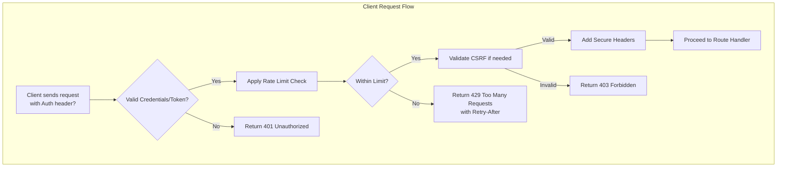

This section covers Security and Auth Middleware, essential tools for protecting your web application against unauthorized access, cross-site attacks, and abuse. These middleware enforce authentication, authorization, and security best practices across routes or the entire app, making it easier to build secure Hono applications. They integrate seamlessly with routing and response handling—for applying them to routes, see 3. Routing. For performance-related protections, see 4.2. Performance Middleware. For request parsing involved in auth flows, see 9.1. Request Parsing and Cookies.

## Overview
Security and Auth Middleware provide ready-to-use protections including **Basic Authentication** for simple username/password checks, **JWT Verification** for token-based auth, **CSRF Protection** to prevent cross-site request forgery, **Rate Limiting** to throttle excessive requests, and **Secure Headers** to harden HTTP responses against common exploits. Users interact with these through standard HTTP mechanisms: entering credentials, providing tokens in headers, or respecting rate limits. When active, protected routes return standard HTTP status codes like *401 Unauthorized* or *403 Forbidden* for invalid access, ensuring secure user experiences.

## Basic Authentication
This middleware requires clients to supply a **username** and **password** via the **Authorization** header in *Basic* format (base64-encoded). Valid requests proceed to the route handler; invalid ones receive a *401 Unauthorized* response with a **WWW-Authenticate** header prompting credentials.

### Configuration
Use the settings below to define valid access:

| Setting | Default | Options | What It Controls |
|---------|---------|---------|------------------|
| **Credentials** | None | Array of objects with *username* (string) and *password* (string) | List of allowed username/password pairs; multiple pairs supported for different users. Required for activation. |
| **Realm** | *Protected Area* | String | Custom text in the *WWW-Authenticate* header, shown in browser login dialogs. |
| **Hash Function** | None | *sha256*, *bcrypt*, or custom hash name | Method for verifying hashed passwords instead of plaintext; improves security for stored credentials. |

> [!NOTE]  
> Browsers automatically prompt for credentials on *401* responses, displaying the **Realm** value.

## JWT Verification
This middleware validates JSON Web Tokens (JWTs) sent in the **Authorization** header as *Bearer <token>*. Valid tokens extract user claims (like *userId*) into the request context for use in handlers; invalid or missing tokens trigger *401 Unauthorized*.

### Configuration
| Setting | Default | Options | What It Controls |
|---------|---------|---------|------------------|
| **Secret** | None | String or key object | Shared secret for signing/verifying HS* algorithms; required. Use environment variables for production. |
| **Algorithms** | *HS256* | Array of *HS256*, *HS384*, *HS512*, *RS256*, *RS384*, *RS512*, *ES256*, *ES384*, *ES512*, *PS256*, *PS384*, *PS512* | Supported signing methods; match your token issuer. |
| **Custom Claims** | None | Object with claim names (e.g., *userId*, *role*) | Expected claims to validate presence; fails if missing. |

> [!WARNING]  
> Exposing the **Secret** invalidates security—rotate immediately if compromised.

## CSRF Protection
This middleware generates and validates anti-CSRF tokens, embedding them in forms or headers. GET requests are exempt; mutable methods (POST, PUT, etc.) require a valid **X-CSRF-Token** header or cookie. Invalid tokens return *403 Forbidden*.

### Configuration
| Setting | Default | Options | What It Controls |
|---------|---------|---------|------------------|
| **Cookie Name** | *csrf-token* | String | Name of the cookie storing the token; clients read it for requests. |
| **Token Length** | *32* | Number | Bytes for generated tokens; longer values increase security. |
| **Ignore Methods** | *GET, HEAD, OPTIONS* | Array of HTTP methods | Exempt methods that skip validation. |

Clients obtain tokens via a preliminary GET to a protected endpoint, which sets the cookie.

## Rate Limiting
This limits requests per client (by IP or custom key), preventing abuse. Exceeding the limit yields *429 Too Many Requests* with a **Retry-After** header.

### Configuration
| Setting | Default | Options | What It Controls |
|---------|---------|---------|------------------|
| **Window** | *60* seconds | Number (ms) | Time period for counting requests. |
| **Limit** | *100* | Number | Max requests allowed per window per client. |
| **Key Generator** | IP address | Function returning string (e.g., header value) | Identifies clients; use headers like *X-Forwarded-For* for proxies. |
| **Message** | *Too Many Requests* | String | Custom body for *429* responses. |

## Secure Headers
Automatically adds security headers to all responses, mitigating XSS, clickjacking, and MIME-sniffing.

### Configuration
| Setting | Default | Options | What It Controls |
|---------|---------|---------|------------------|
| **X-Content-Type-Options** | *nosniff* | *nosniff* or off | Prevents MIME-type sniffing. |
| **X-Frame-Options** | *SAMEORIGIN* | *DENY*, *SAMEORIGIN*, *ALLOW-FROM uri* | Blocks framing attacks. |
| **X-XSS-Protection** | *1; mode=block* | *0*, *1; mode=block* | Enables XSS filters in older browsers. |
| **Referrer-Policy** | *strict-origin-when-cross-origin* | Standard policy values | Controls referrer info leakage. |
| **Permissions-Policy** | Empty | Feature policy string | Restricts browser features like geolocation. |

## Applying Middleware
Apply protections to specific routes, route groups, or the app root for global enforcement. Order matters—auth before rate limiting.

1. Select the target: individual route, group, or app.
2. Choose middleware (e.g., **Basic Authentication**).
3. Configure options via settings.
4. Test: send requests with/without credentials; observe *401*, *403*, or *429* responses.

## Troubleshooting
Common issues appear as HTTP responses or headers—check browser dev tools or client logs.

| Message | Severity | Meaning |
|---------|----------|---------|
| *401 Unauthorized* with **WWW-Authenticate** | Error | Credentials missing or invalid; verify **Credentials** list and header format. |
| *401 Unauthorized* without prompt | Error | JWT **Secret** mismatch or expired token; check **Algorithms** and token issuer. |
| *403 Forbidden* on forms | Error | CSRF token absent or mismatch; ensure client reads **Cookie Name** and sends **X-CSRF-Token**. |
| *429 Too Many Requests* | Warning | Exceeded **Limit** in **Window**; client should respect **Retry-After** or adjust **Key Generator**. |
| Missing security headers | Info | **Secure Headers** not applied; confirm middleware covers the route. |

## Summary
- **Basic Authentication** uses username/password for simple protection; configure **Credentials** and **Realm**.
- **JWT Verification** handles token auth; set **Secret** and **Algorithms**.
- **CSRF Protection** secures forms; customize **Cookie Name**.
- **Rate Limiting** thwarts abuse; tune **Window** and **Limit**.
- **Secure Headers** auto-hardens responses; adjust policies as needed.
For integration, see 3. Routing and 4.2. Performance Middleware. For deployment considerations, see 8. Runtime Adapters and Deployment.