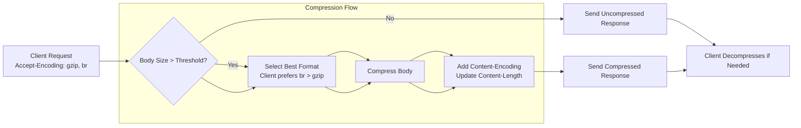

This section covers Performance Middleware, a set of built-in optimizations for speeding up response delivery in your web applications and APIs through caching, ETag handling, content compression, and request body size limits. It's designed for users building scalable services who want to reduce latency, bandwidth consumption, and server load without manual effort. These middleware work alongside your route handlers and other middleware stacks; see Routing|3. Routing for defining paths, Security and Auth Middleware|4.1. Security and Auth Middleware for protective layers, and Rendering Responses|5. Rendering Responses for output formatting. They automatically apply to matching requests, improving overall app efficiency across runtimes like those in Runtime Adapters and Deployment|8. Runtime Adapters and Deployment.

## Overview

Performance Middleware intercepts incoming requests and outgoing responses to apply optimizations transparently. Key capabilities include:
- **Caching**: Stores computed responses for quick reuse based on configurable directives.
- **ETags**: Adds content hashes to responses and validates client-provided ETags for conditional serving.
- **Compression**: Reduces payload sizes dynamically based on client capabilities.
- **Body Limits**: Rejects oversized incoming payloads early to save resources.

Users experience faster page loads, lower data transfer, and protection from denial-of-service attempts via large requests. These features activate per-route or globally, with responses including standard HTTP headers like **Cache-Control**, **ETag**, **Content-Encoding**, and **Content-Length**.

## Caching

The caching layer checks for valid stored responses before processing routes. If a cache hit occurs, the stored response serves immediately with minimal overhead. On misses, it computes the response, stores it, and serves it.

Users observe:
- Repeat requests returning instantly with **304 Not Modified** or cached content.
- Headers like **Cache-Control: public, max-age=3600** indicating storage rules.

> [!NOTE]  
> Caching applies only to safe methods (GET, HEAD) by default and respects query parameters unless configured otherwise.

| Cache Control Directive | Default | Accepted Values | Description |
|-------------------------|---------|-----------------|-------------|
| **max-age** | *0* (no cache) | Number of seconds (e.g., *3600*) | Time clients and proxies hold the response before revalidation. |
| **s-maxage** | *unset* | Number of seconds | Shared proxy cache duration (overrides **max-age** for proxies). |
| **public** | *false* | *true*, *false* | Allows public caching by proxies/CDNs. |
| **private** | *false* | *true*, *false* | Restricts to private client caches only. |
| **no-cache** | *false* | *true*, *false* | Forces revalidation even if expired. |
| **no-store** | *false* | *true*, *false* | Prevents any caching entirely. |

## ETags

ETags generate a unique identifier (hash) for each response body, appended as the **ETag** header. On subsequent requests, the middleware checks the client's **If-None-Match** header:
- Match: Returns **304 Not Modified** (no body sent).
- Mismatch: Serves full fresh response with updated **ETag**.

Users see reduced bandwidth on browser refreshes or API polls, with network tabs showing efficient conditional fetches.

| ETag Setting | Default | Options | What It Controls |
|--------------|---------|---------|------------------|
| **ETag Type** | *weak* | *weak*, *strong* | *Weak* allows minor changes (e.g., timestamps); *strong* requires byte-identical content. |
| **Auto-Generate** | *true* | *true*, *false* | Enables automatic hashing for text/HTML/JSON responses. |
| **Weak Prefix** | *W/* | Custom string | Prefix for weak ETags (e.g., *W/"abc123"*). |

## Compression

Compression scans response bodies above a size threshold and encodes them (e.g., gzip) if the client supports it via **Accept-Encoding**. The **Content-Encoding** header signals the format, and **Content-Length** reflects the compressed size.

Users benefit from smaller downloads, especially on mobile or slow connections, visible in dev tools as compressed transfer sizes.

| Compression Format | Default Threshold | Supported Clients | Description |
|--------------------|-------------------|-------------------|-------------|
| **gzip** | *1024* bytes | Most browsers/proxies | Balanced compression; widely compatible. |
| **br** (Brotli) | *500* bytes | Modern browsers (Chrome 50+, Firefox 44+) | Higher ratio than gzip; smaller payloads. |
| **deflate** | *off* | Legacy clients | Zlib format; rarely used today. |

## Body Limits

This middleware parses the **Content-Length** header and rejects requests exceeding limits during body reading (e.g., JSON, form data). Oversized requests return **413 Payload Too Large** immediately.

Protects against abuse; users see clean errors instead of crashes.

| Body Limit Setting | Default | Accepted Values | What It Controls |
|--------------------|---------|-----------------|------------------|
| **Global Limit** | *1mb* | Size string (e.g., *10mb*, *1gb*) | Total body size for all types. |
| **JSON Limit** | *1mb* | Size string | Specifically for **application/json**. |
| **Form Limit** | *1mb* | Size string | For **application/x-www-form-urlencoded** or multipart. |
| **Error Status** | *413* | HTTP status code | Response code on exceedance. |

## Configuration / Settings

Apply these globally or per-route via middleware settings. Changes take effect on restart.

| Setting | Default | Options | What It Controls |
|---------|---------|---------|------------------|
| **Enable Caching** | *true* | *true*, *false* | Activates cache checks/storage. |
| **Cache Max-Age** | *3600* | Seconds (0 to disable) | Base duration for **max-age**. |
| **ETag Type** | *weak* | *weak*, *strong* | Strength of generated ETags. |
| **Enable Compression** | *true* | *true*, *false* | Turns on dynamic encoding. |
| **Compression Threshold** | *1024* bytes | Bytes (0 to always compress) | Minimum body size to compress. |
| **Supported Encodings** | *gzip,br* | Comma-separated (*gzip*, *br*, *deflate*) | Formats offered to clients. |
| **Body Size Limit** | *1mb* | Size string (kb, mb, gb) | Maximum incoming payload. |
| **Cache Vary Header** | *Accept,Accept-Language* | Header list | Keys for cache segmentation (e.g., vary by language). |

## Troubleshooting

Common issues appear as HTTP status codes or headers in browser dev tools/network logs.

| Message | Severity | Meaning |
|---------|----------|---------|
| **413 Payload Too Large** | Error | Request body exceeds configured limit; reduce payload size or increase **Body Size Limit**. |
| **304 Not Modified** | Info | ETag or cache matched; normal optimization—no action needed. |
| **Content-Encoding: gzip** (but garbled) | Warning | Client lacks decompression; check **Accept-Encoding** support or disable compression. |
| No **Cache-Control** header | Warning | Caching disabled or route excluded; verify middleware order after Routing|3. Routing. |

## Summary

- Use **Caching** and **ETags** for repeat request speedups with configurable directives like **max-age** and *weak*/*strong* types.
- Enable **Compression** for bandwidth savings, supporting *gzip* and *br* above thresholds.
- Set **Body Limits** to block oversized requests with **413** errors.
- Configure via settings tables above for global/route-specific tweaks; monitor headers in dev tools for verification.

For integration with routes, see Basic and Parametric Routes|3.1. Basic and Parametric Routes. Combine with security in Security and Auth Middleware|4.1. Security and Auth Middleware and test performance via runtime-specific tools in Runtime Adapters and Deployment|8. Runtime Adapters and Deployment.