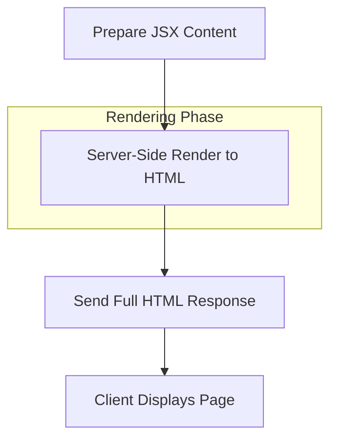

This section covers generating and rendering responses in your Hono application, such as JSON for APIs, HTML for web pages, CSS for stylesheets, JSX for dynamic server-side rendering, and streaming for real-time or large payloads. It's designed for application builders creating interactive web apps, APIs, or server-rendered sites. These responses are returned from route handlers defined in [Routing](routing), after processing through [Middleware](middleware). For serving pre-built files instead of dynamic rendering, see [Static Files and Assets](static-files-and-assets). Platform-specific behaviors, like streaming on serverless runtimes, are detailed in [Runtime Adapters and Deployment](runtime-adapters-and-deployment).

## Overview
Rendering responses allows you to send formatted content back to clients from your application's handlers. Key capabilities include automatic serialization for structured data, markup rendering for pages, stylesheet delivery, progressive streaming to reduce latency, and redirects for navigation. The system sets appropriate **Content-Type** headers, handles encoding for binary content, and supports both full responses and chunked delivery.

## JSON Responses
Use JSON rendering to deliver structured data, such as API payloads with objects, arrays, primitives (*string*, *number*, *boolean*), *null*, or empty objects `{}`. The system automatically serializes the data and sets **Content-Type: application/json**.

| Data Type | Example Input | Resulting Response | Notes |
|-----------|---------------|--------------------|-------|
| Object | `{ "id": 123, "title": "Example" }` | `{"id":123,"title":"Example"}` | Nested objects and arrays supported. |
| Array | `[1, "two", true]` | `[1,"two",true]` | Homogeneous or mixed types. |
| Primitive | `42` or `"text"` | `42` or `"text"` | Single values wrapped in JSON. |
| Null | `null` | `null` | Empty body for null. |
| Empty Object | `{}` | `{}` | Minimal valid JSON. |

Clients receive parsable JSON. Unsupported types like certain large integers may trigger errors—see **Troubleshooting**.

## HTML, CSS, and Text Responses
Send markup, styles, or plain text as string content. HTML renders full pages with **Content-Type: text/html**, CSS uses **text/css**, and plain text defaults to **text/plain**.

| Format | Typical Input | Resulting **Content-Type** | Use Case |
|--------|---------------|----------------------------|----------|
| HTML | `"<h1>Hello</h1>"` | `text/html` | Server-rendered pages. |
| CSS | `"body { color: blue; }"` | `text/css` | Inline stylesheets. |
| Text | `"Plain message"` | `text/plain` | Logs, messages, or raw data. |

The response body contains the exact string provided, with automatic character encoding.

## JSX and DOM Rendering
JSX content is processed server-side into HTML for immediate client display, enabling dynamic pages without client-side hydration. Prepare JSX-like structures in handlers; the system compiles and renders them to a DOM-compatible HTML string.

- Rendered output appears as standard HTML in the browser.
- Supports components, props, and event placeholders for interactive apps.
- Ideal for initial page loads in server-side rendering (SSR) workflows.



## Streaming Responses
For large datasets, real-time updates, or SSR with partial hydration, use streaming to send content in chunks. Clients receive data progressively, improving perceived performance—no full buffer wait required.

- Chunks are written sequentially to the response stream.
- Headers (status, cookies) sent first, followed by body chunks.
- Ends automatically when all content is delivered.

Supported on compatible runtimes; fallback to full responses otherwise.

```mermaid
flowchart LR
    A[Start Response Stream] --> B[Write Headers & Status]
    B --> C[Write Chunk 1<br/>(e.g., Page Header)]
    C --> D[Write Chunk 2<br/>(e.g., Dynamic Data)]
    D --> E[End Stream]
    subgraph "Client Experience"
        F[Receive Headers Immediately]
        F --> G[Render Progressively]
    end
    E --> G
```

## Redirects
Issue redirects by specifying a target URL and status code (e.g., *302 Found* or *301 Moved Permanently*). The system sets the **Location** header and appropriate status.

| Status Type | Example Target | Client Behavior |
|-------------|----------------|-----------------|
| Temporary (302) | `/new-page` | Browser navigates without caching. |
| Permanent (301) | `https://example.com` | Cached for SEO and performance. |

## Configuration
Limited user options control rendering globally or per-response.

| Setting | Default | Options | What It Controls |
|---------|---------|---------|------------------|
| Binary Content Detection | Auto (regex-based) | Custom function | Determines base64 encoding for non-text (images, binaries). Use for custom MIME types. |
| Status Code | 200 | 100–599 | HTTP status for all responses. |

Configure via runtime adapter options where applicable—see [Runtime Adapters and Deployment](runtime-adapters-and-deployment).

## Troubleshooting
Common issues appear as HTTP errors or browser console messages.

| Message | Severity | Meaning |
|---------|----------|---------|
| Internal Server Error (500) | Error | Request processing failed, often due to invalid input. Check handler logic and retry. |
| Do not know how to serialize a BigInt | Error | Large integer values can't be JSON-encoded. Convert to *string* or *number*. |
| Content truncated | Warning | Binary or oversized body exceeded limits. Use streaming or compress. |

> [!NOTE]  
> Always validate inputs before rendering to avoid serialization errors. Test streams in target runtime previews.

## Summary
- Render JSON for APIs with automatic serialization of common data types.
- Use HTML/CSS/text for direct content delivery with proper headers.
- Enable JSX for SSR pages and streaming for low-latency dynamic apps.
- Issue redirects with status codes for navigation flows.
- For route integration, see [Routing](routing); for middleware effects on responses, see [Middleware](middleware); for static alternatives, see [Static Files and Assets](static-files-and-assets).