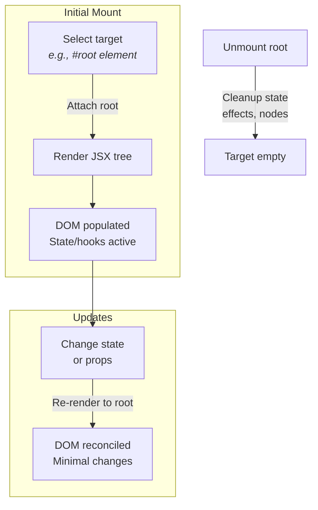

This section covers JSX and DOM rendering, enabling you to mount interactive JSX components directly into browser DOM elements on the client side, hydrate server-rendered content, and generate HTML output on the server side. It's designed for developers creating dynamic web applications within Hono, integrating seamlessly with routing and middleware for full-stack experiences. As part of [Rendering Responses](rendering-responses), it pairs with [Streaming Responses](streaming-responses) for efficient updates and supports static assets via [Static Files and Assets](static-files-and-assets). See [Getting Started](getting-started) for project setup and [Routing](routing) for page-based rendering.

## Overview
JSX and DOM rendering lets you build and display components as native browser DOM trees, handling updates efficiently with state and effects. On the client, it mounts JSX trees to target elements, replacing or hydrating content while preserving performance for large lists. On the server, it produces HTML strings or streams, supporting nested and async components where applicable. Key capabilities include prop spreading, children nesting, attribute handling (including styles and booleans), and hook integration for interactivity.

## Client-Side Rendering
Client-side rendering attaches your JSX components to a specific **HTMLElement** or **DocumentFragment** in the browser, making them interactive with state changes and event handlers.

### Mounting and Updating
1. Select a target container element in your HTML, such as `

`.
2. Create a rendering root attached to that element.
3. Render your top-level JSX component (or tree of components) to the root—this builds and inserts the DOM nodes, replacing any existing content.
4. To update, render a new JSX tree to the same root; it reconciles changes efficiently (O(N) performance for additions).
5. Unmount the root to clean up state, effects, and DOM nodes.

Hydration works identically to initial rendering but assumes the target already contains matching server-rendered HTML, attaching interactivity without reflow.

> [!NOTE]  
> Rendering replaces the target's content entirely. For partial updates, nest within existing structures.

### Supported Features
- **Text content**: Direct strings render as text nodes.
- **Lists**: Efficient rendering for 1000+ items without lags.
- **Event handlers**: Click, etc., trigger updates seamlessly.
- **Refs**: Attach to DOM nodes for direct manipulation.

## Server-Side Rendering
Server rendering generates static HTML from JSX for initial page loads, SEO, or static exports.

1. Pass your JSX tree to the rendering process.
2. Receive either a complete HTML string (synchronous, no async components) or a readable stream (supports async components and Suspense boundaries).
3. Use the output in responses, wrapping in layouts or doctype as needed.

Streams enable progressive loading, integrating with Hono's response handling.

> [!WARNING]  
> Synchronous string rendering fails on async components—use streams instead.

| Output Type | Supports Async Components | Use Case | Result |
|-------------|---------------------------|----------|--------|
| HTML String | No | Quick static pages | Full `<tag attr="value">content</tag>` |
| Readable Stream | Yes | Dynamic pages with delays | Chunked HTML bytes for fast first paint |

## Props and Children Handling
Props define element attributes, styles, and behavior; children provide nested content. Null/undefined props are ignored.

| Field/Prop Type | Required | Accepted Values | Description |
|-----------------|----------|-----------------|-------------|
| **id**, **class** | No | *string* | Sets standard attributes (e.g., `id="app"`). |
| **style** | No | *object* (e.g., `{fontSize: '10px'}`) or *string* | Converts to inline CSS (camelCase to kebab-case, CSS vars preserved). Updates trigger style recalc. |
| Boolean attrs (e.g., **hidden**) | No | *true/false* | Adds attribute if true (e.g., `hidden=""`); omits if false. |
| **children** | No | *string*, *array of JSX/text*, *nested JSX* | Renders as content; arrays flatten recursively. |
| **key** | No | *string/number* | Aids reconciliation in lists. |
| **ref** | No | *ref object* | Attaches to DOM node post-render. |
| Custom attrs (e.g., **data-hello**) | No | *any* (toString() called) | Sets as attribute value. |
| **dangerouslySetInnerHTML** | No | `{__html: *string*}` | Injects raw HTML; children ignored if present (error thrown). |

> [!NOTE]  
> Empty self-closing tags (e.g., `<input />`) render without close tags; those with children get full tags.

## Hooks Integration
Rendering fully supports hooks for state, effects, transitions, and deferred values within components. State updates automatically re-render the tree. Transitions batch updates for smoother UIs; view transitions animate DOM changes where browser-supported.

## Configuration and Options
Most options trigger browser console warnings as unsupported.

| Setting | Default | Options | What It Controls |
|---------|---------|---------|------------------|
| Root options | `{}` | *any object* | Ignored; warns in console. |
| Render stream options | `{}` | *onError* callback only | Others ignored; warns in console. |

## Troubleshooting

| Message | Severity | Meaning |
|---------|----------|---------|
| Options are not supported yet | Warning | Extra settings passed to rendering ignored—remove them for clean logs. |
| Cannot update an unmounted root | Error | Attempted render after unmount; re-create root or avoid post-unmount calls. |
| Async component is not supported in renderToString | Error | Used sync string output with async content; switch to streams. |

> [!WARNING]  
> Both **dangerouslySetInnerHTML** and children on one element cause rendering errors—choose one.

## Summary
- Mount JSX to DOM elements via roots for interactive client apps; hydrate for SSR matching.
- Server-render to strings (sync/static) or streams (async/progressive).
- Props handle attrs, styles, booleans automatically; children nest deeply.
- Hooks enable stateful updates with efficient reconciliation.
- Limited options; watch console for warnings.

For advanced streaming, see [Streaming Responses](streaming-responses). Integrate with [WebSockets](websockets) for real-time or [Middleware](middleware) for auth-protected renders. Configuration details in [Configuration Reference](configuration-reference).