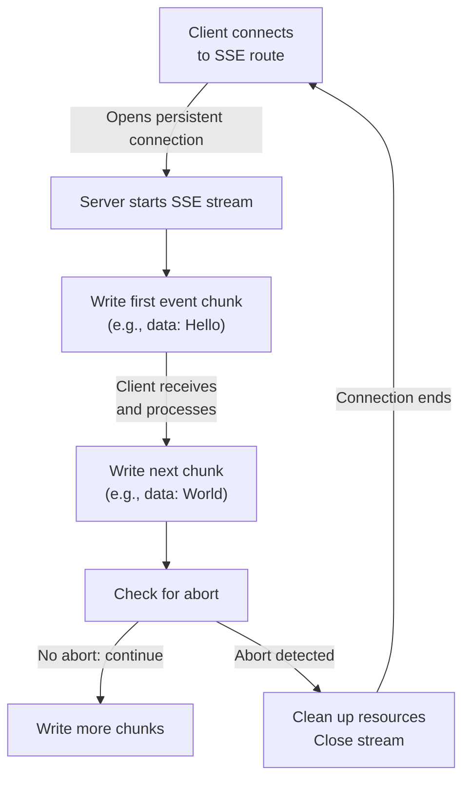
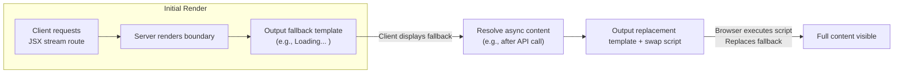

This section covers Streaming Responses, including Server-Sent Events (SSE) and JSX streaming, which enable real-time, incremental data delivery to clients in your web applications. It's designed for users building interactive apps that require live updates, such as chat feeds, progress indicators, or dynamic content loading without full page reloads. Streaming integrates with response rendering workflows, building on static JSX output from 5.1 JSX and DOM Rendering and route handlers in 3. Routing. For full-page rendering options, see 6. Static Files and Assets.

## Overview
Streaming Responses allow your application to deliver content to the browser in chunks rather than all at once. This supports real-time updates via SSE for event streams or JSX streaming for progressive UI rendering. Clients receive data immediately as it's generated, reducing wait times and enabling features like loading states or live notifications. Key capabilities include handling client disconnections gracefully and supporting fallback content during delays.

## Server-Sent Events (SSE)
SSE establishes a persistent connection where your server pushes discrete events to the client. Clients typically connect using browser APIs that listen for these events.

### What Users See and Do
- **Clients** observe a continuous stream of events in their browser console or event listeners, formatted as lines starting with *data:* followed by the message, ending with two newlines.
- **Server-side**, in a designated route handler, initiate the stream to write event chunks dynamically.
- Use the stream to send updates like status messages or new data arrivals.

### Workflow
1. Define a route matching client requests for real-time events (e.g., */events*).
2. Within the handler, start the SSE stream and set appropriate response headers automatically (e.g., *Content-Type: text/event-stream*, *Cache-Control: no-cache*).
3. Write event data in chunks using the stream interface.
4. Monitor for client aborts (e.g., page close or navigation) to clean up resources.
5. End the stream when no more events are expected or on completion.

> [!NOTE]  
> SSE is unidirectional (server to client). For bidirectional communication, see 7. WebSockets.

## JSX Streaming
JSX Streaming renders components incrementally, ideal for async content or server-side rendering with fallbacks. It outputs initial placeholders or loading states, then swaps in resolved content via client-side scripts.

### What Users See and Do
- **Clients** first see a *fallback* UI (e.g., "Loading..."), followed by seamless replacement with full content—no flicker or full reload.
- **Server-side**, wrap async components in a boundary that handles delays.
- Supports styled components and escapes content automatically.

### Key Controls and Fields
| Field | Required | Accepted Values | Description |
|-------|----------|-----------------|-------------|
| **fallback** | Yes | JSX element or fragment | Initial content shown while primary content loads (e.g., spinner or message). |
| **Primary content** | Yes | Async JSX resolving to HtmlEscapedString | The dynamic part that streams in after resolution. |

### Workflow
1. Structure your JSX with a boundary around slow or async sections.
2. Specify **fallback** content for immediate display.
3. Render the response as a readable stream in the handler.
4. Client receives chunks: first the fallback in a template, then a script that inserts resolved content.

> [!WARNING]  
> Ensure async content resolves promptly to avoid prolonged fallback display. Client-side script handles the swap automatically.

## Configuration
No user-configurable settings are required for basic streaming—headers and formats are handled automatically. For advanced styling in JSX streams:

| Setting | Default | Options | What It Controls |
|---------|---------|---------|------------------|
| **nonce** | None | String (e.g., *1234*) | Adds security attribute to inline styles/scripts for Content Security Policy compliance. |

## Troubleshooting
Common issues arise from client disconnections or unresolved async content.

| Message | Severity | Meaning |
|---------|----------|---------|
| Stream aborted unexpectedly | Info | Client closed connection (e.g., navigation). Verify abort handlers release resources like timers or DB queries. |
| Fallback persists indefinitely | Warning | Async JSX content failed to resolve. Check network delays or errors in dependent fetches; add timeouts. |
| Empty or malformed chunks received | Error | Stream write failed post-abort. Ensure writes occur only before checking abort status. |

## Summary
- Use SSE for simple server-push events like notifications, with automatic event formatting and abort handling.
- Leverage JSX Streaming for progressive UIs, providing **fallback** content during async loads via template swapping.
- Integrates seamlessly with route handlers; monitor aborts for resource management.
- For static alternatives, see 5.1 JSX and DOM Rendering; for interactive streams, explore 7. WebSockets. Refer to [Rendering Responses](rendering-responses) for broader context.