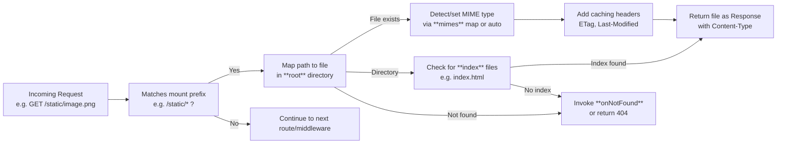

This section covers Static Files and Assets, allowing you to serve static content such as individual files, entire directories, and single-page applications (SPAs) directly within your Hono application. It's designed for users who need to deliver assets like images, CSS, JavaScript, fonts, or full static sites alongside dynamic routes, with options for custom MIME types and fallback handling for missing resources. This feature integrates seamlessly with your routing configuration; see [Routing](routing) for mounting static handlers on specific paths, [Rendering Responses](rendering-responses) for combining with other response types, and [Static Site Generation (SSG)](static-site-generation-ssg) for pre-building optimized static content.

## Overview

Static file serving provides a fast, efficient way to handle requests for unchanging assets without custom route handlers for each file. Key capabilities include automatic file lookup from a base directory, intelligent MIME type detection, directory indexing via default files, and customizable fallbacks for 404 scenarios. Mount it on route prefixes like **/assets/** or **/static/** to serve content efficiently, with built-in support for caching headers to improve performance.

## Mounting Static File Serving

Attach static serving to specific route patterns to handle requests for assets. Users typically mount it early in their route setup to prioritize asset delivery.

1. Choose a route prefix, such as **/static/**, for all asset requests.
2. Configure the handler with your desired base directory and options.
3. Apply it to the prefix; requests matching the pattern will attempt to serve files, falling back to other routes if no match.

> [!NOTE]  
> Place static handlers before dynamic routes sharing similar paths to ensure assets are served first.

## Request Flow

## Configuration Options

Use these settings to customize behavior when mounting the static handler.

| Setting     | Default                  | Options                          | What It Controls |
|-------------|--------------------------|----------------------------------|------------------|
| **root**   | *current directory*     | Absolute or relative path string | Base folder for file lookups (e.g., `./public` or `/var/www/assets`). Requests to `/static/file.jpg` serve from `root/file.jpg`. Required for operation. |
| **index**  | `['index.html', 'index.htm']` | Array of strings                | Files automatically served for directory requests (e.g., `/static/docs/` serves `root/docs/index.html`). Empty array disables indexing. |
| **mimes**  | Platform MIME defaults  | Object `{extension: 'mime/type'}` | Custom MIME type mappings (e.g., `{'.wasm': 'application/wasm'}`). Overrides auto-detection for better browser compatibility. |
| **onNotFound** | Return 404 Not Found   | Handler function                | Custom response for missing files (e.g., serve SPA `index.html` or redirect). Useful for single-page apps. |

> [!WARNING]  
> Setting **root** to a system directory (e.g., `/`) can expose sensitive files—always use a dedicated assets folder.

## Custom MIME Types

Override default MIME detection for non-standard files.

- Enter extensions without dots (e.g., `avif`).
- Values follow standard MIME format (e.g., `image/avif`).
- Changes apply only to files served by this handler.

Example mappings:
| Extension | MIME Type              | Use Case              |
|-----------|-----------------------|-----------------------|
| **wasm** | *application/wasm*    | WebAssembly modules  |
| **avif** | *image/avif*          | AVIF images          |
| **br**   | *font/br*             | Brotli-compressed    |

## Single-Page Applications (SPAs)

For SPAs, configure **onNotFound** to rewrite client-side routes to your main **index.html**:

1. Set **root** to your built SPA directory (e.g., `./dist`).
2. Mount on `/*` (catch-all) or `/app/*`.
3. In **onNotFound**, return the **index.html** file or a redirect.

This ensures paths like `/app/user/123` serve **index.html** for client routing.

## Directory Serving

- Requests to directories (ending in `/`) automatically append **index** files.
- No directory listing is generated—use **index** files for custom listings.
- Trailing slashes are normalized ( `/static/docs` → `/static/docs/` ).

## Troubleshooting

No specific log messages are emitted by static serving, as it operates silently on successful file delivery. Common issues:

| Observable Behavior                  | Severity | Meaning and Resolution |
|--------------------------------------|----------|-------------------------|
| Browser shows 404 for existing file | Error   | Path mismatch or incorrect **root**. Verify file exists at `root + requested path` and prefix matches exactly. |
| Wrong Content-Type (e.g., binary as text) | Warning | Missing MIME mapping. Add to **mimes** and reload. Check browser dev tools Network tab. |
| Infinite redirect on SPA routes     | Error   | **onNotFound** looping. Ensure handler returns without re-triggering static lookup. |
| Slow asset loads                    | Warning | Large files without caching. Static serving adds ETag/Last-Modified by default—enable gzip via middleware (see [Middleware](middleware)). |

## Summary

- Serve files, directories, and SPAs from a **root** folder using customizable MIME types (**mimes**) and fallbacks (**onNotFound**).
- Use **index** files for directory access and mount on prefixes like **/static/** for organization.
- Ideal for assets in dynamic apps; combine with [Routing](routing) for path control and [Static Site Generation (SSG)](static-site-generation-ssg) for pre-built optimization.
- For performance tweaks, layer with caching middleware from [Middleware](middleware).

See [Rendering Responses](rendering-responses) for dynamic content alongside static assets, and [Configuration Reference](configuration-reference) for global settings.