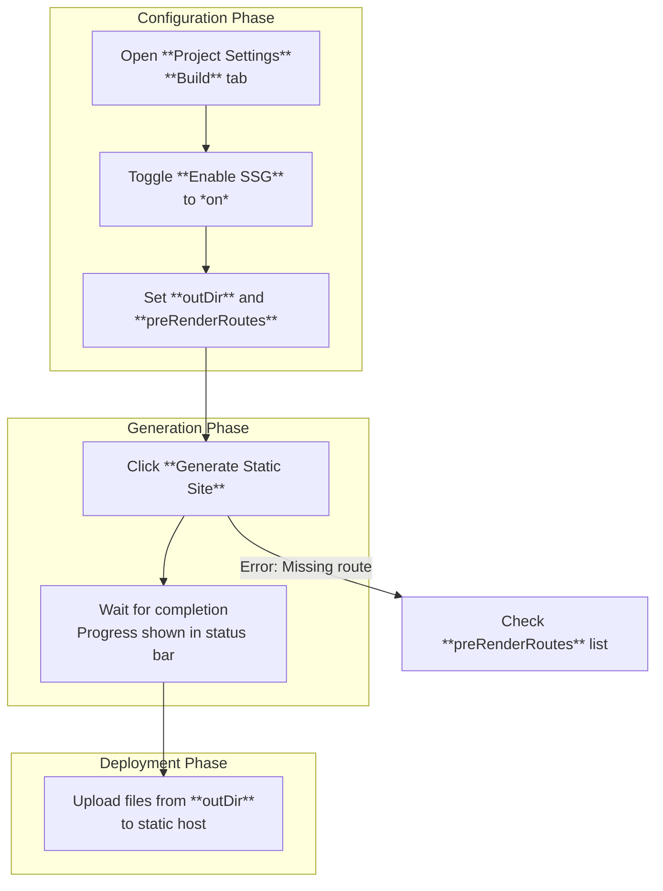

This section covers **Static Site Generation (SSG)**, which pre-renders your application's routes into standalone HTML files for deployment to static hosting platforms like CDNs or file servers. It's designed for end users building fast, serverless websites where dynamic routes are converted to static content at build time, improving load times and reducing hosting costs. SSG works alongside your defined routes and static assets; for route definitions, see [Routing](routing). For handling images, CSS, and other files, see [Static Files and Assets](static-files-and-assets). Once generated, deploy the output via [Runtime Adapters and Deployment](runtime-adapters-and-deployment).

## Overview
**Static Site Generation (SSG)** scans your application's routes and generates fully-formed HTML pages for each one, including any embedded styles, scripts, or data fetched during pre-rendering. This produces a folder of static files ready for upload to any web host, without needing a runtime server. Key capabilities include:
- Automatic pre-rendering of all or selected routes.
- Support for parametric routes (e.g., `/user/[id]`) by generating pages for specified parameter values.
- Output of optimized HTML with inline critical resources for instant page loads.
- Integration with your existing app structure—no code changes required beyond configuration.

Users typically enable SSG during the build phase to create deployable artifacts.

## Enabling and Using SSG
To start using SSG, activate it in your project settings and specify routes. The process involves configuring options, triggering generation, and reviewing the output folder.

### Step-by-Step: Generating a Static Site
1. Open your **Project Settings** panel and navigate to the **Build** tab.
2. Toggle **Enable SSG** to *on*.
3. In the **SSG Configuration** section, set your desired options (see table below).
4. Click **Generate Static Site**—the system processes all routes, fetches any dynamic data, and creates HTML files.
5. Review the generated files in the output directory; upload them directly to your hosting provider.

> [!NOTE]  
> Parametric routes require explicit values in **preRenderRoutes** (e.g., `/user/123`, `/user/456`) to generate multiple pages.

### Output Structure
After generation, the output directory contains:
- An **index.html** for the root route (`/`).
- Individual HTML files for each pre-rendered route (e.g., `user-123.html` for `/user/123`).
- A copy of static assets in a parallel **assets** folder.
- A **sitemap.xml** listing all generated pages.

## Configuration / Settings
Configure SSG options in the **SSG Configuration** section of your **Project Settings** > **Build** tab.

| Setting | Default | Options | What It Controls |
|---------|---------|---------|------------------|
| **outDir** | *dist* | Any valid folder path (e.g., *public*, *build/output*) | The directory where generated HTML files and assets are saved. Changing it updates the build output location. |
| **preRenderRoutes** | *['/']* (root only) | Array of path strings (e.g., *['/', '/about', '/user/123', '/user/456']*) | List of exact routes to pre-render. Use parametric values for dynamic routes; omitted routes are skipped. Supports wildcards like *['/blog/*']* for bulk generation. |
| **enableSSG** | *off* | *on* / *off* | Toggles SSG entirely. When *off*, builds produce a server bundle instead. |

> [!WARNING]  
> Setting a large **preRenderRoutes** list (e.g., >1000 items) may increase build time significantly. Test incrementally.

## Troubleshooting
Common issues during SSG generation appear as status messages in the build log panel.

| Message | Severity | Meaning |
|---------|----------|---------|
| "No routes specified for pre-rendering" | Warning | **preRenderRoutes** is empty; only the root `/` is generated. Add routes to the list and regenerate. |
| "Failed to pre-render /user/[id]: Data fetch timeout" | Error | Dynamic data for a parametric route couldn't load. Check network or data source; reduce **preRenderRoutes** or provide fallback data. |
| "Output directory already exists and is not empty" | Warning | **outDir** has files; generation skips to avoid overwrite. Clear the folder or change **outDir**. |
| "Build completed: X pages generated" | Info | Success indicator; X is the count of HTML files created. Ready for deployment. |

## Summary
- **Static Site Generation (SSG)** pre-renders routes to HTML for static deployment, perfect for performance-focused sites.
- Configure via **outDir** and **preRenderRoutes** in **Project Settings** > **Build**.
- Follow the workflow: enable → configure → **Generate Static Site** → deploy from output folder.
- Handles parametric routes with explicit values; integrates with [Routing](routing) and [Static Files and Assets](static-files-and-assets).
- For hosting generated files, see [Runtime Adapters and Deployment](runtime-adapters-and-deployment) and Getting Started#Running the App.