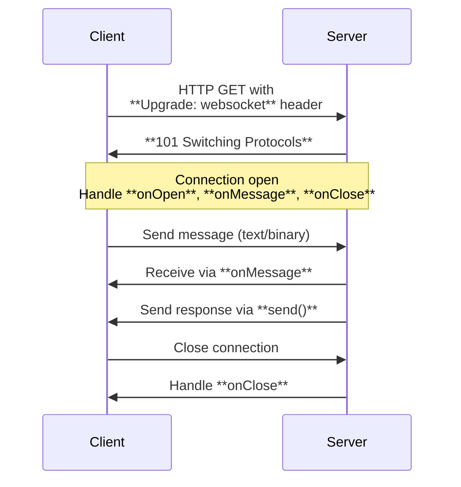

This section covers WebSockets, enabling real-time, bidirectional communication in your applications through persistent connections upgraded from standard HTTP requests. It's for users building interactive experiences such as live chats, real-time dashboards, or collaborative editing tools. WebSocket endpoints integrate seamlessly with your routing setup, allowing event-driven handling alongside traditional HTTP routes. For defining the paths where WebSockets are available, see [Routing](routing). For runtime-specific behaviors, see [Runtime Adapters and Deployment](runtime-adapters-and-deployment). For client-side typed access to these endpoints, see [Utilities and Validation](utilities-and-validation).

## Overview
WebSockets provide low-latency, full-duplex channels for exchanging messages between clients and servers without repeated HTTP polling. Clients initiate an upgrade from an HTTP GET request, and once established, your application handles events like connection opens, incoming messages, and closures. Messages support both text (*string*) and binary formats (*ArrayBuffer*, *Blob*). Connections maintain state via a context object offering send, close, and status inspection controls.

## Upgrading HTTP to WebSocket
Clients trigger the upgrade by including an **Upgrade: websocket** header in their HTTP request to a designated route. Your server validates the request and responds with a **101 Switching Protocols** status if the upgrade succeeds, establishing the persistent connection. Non-upgrade requests (lacking the header) proceed to standard HTTP handling or the next middleware/route.

Use the following workflow to manage upgrades:

1. Define a route path dedicated to WebSockets (e.g., **/ws** or **/chat/:room**).
2. Configure the route to detect and accept upgrade requests.
3. Provide event handlers for connection lifecycle management.

> [!NOTE]  
> Only routes explicitly configured for WebSockets respond to upgrade requests. Others ignore the **Upgrade** header and process as regular HTTP.

## Handling WebSocket Events
Once upgraded, connections trigger specific events you can respond to. Each event receives details about the occurrence and access to a **WSContext** object for controlling the connection.

| Event      | Triggered When                  | Parameters Provided                          | Typical Actions |
|------------|---------------------------------|----------------------------------------------|-----------------|
| **onOpen** | New connection established     | *Event*, **WSContext**                      | Send welcome message, authenticate, join room |
| **onMessage** | Message received from client | *MessageEvent* (*string*, *Blob*, or *ArrayBuffer*), **WSContext** | Parse data, broadcast to others, update state |
| **onClose** | Connection closes (normal or error) | *CloseEvent*, **WSContext**                | Clean up resources, log disconnection, notify group |
| **onError** | Error occurs (e.g., protocol violation) | *Event*, **WSContext**                    | Log issue, close gracefully, retry logic |

## WSContext Controls
The **WSContext** provides runtime controls visible during event handling:

| Control       | Type/Format                  | Description |
|---------------|------------------------------|-------------|
| **send**     | *string*, *ArrayBuffer*, or *Uint8Array* + optional **SendOptions** (*compress: boolean*) | Transmit data back to client. Use compression for large payloads. |
| **close**    | Optional *code* (number, 1000–4999), *reason* (*string*) | Terminate connection gracefully. Default code is 1000 (normal). |
| **readyState** | Number (0: connecting, 1: open, 2: closing, 3: closed) | Current connection status. Check before sending. |
| **url**      | *URL* object                 | Full WebSocket URL (e.g., *ws://example.com/ws*). |
| **protocol** | *string* or *null*           | Negotiated subprotocol (if specified in upgrade). |
| **binaryType** | *'arraybuffer'* (default) or *'blob'* | Format for incoming binary messages. |
| **raw**      | Runtime-specific object      | Adapter details (e.g., native socket). |

**SendOptions** table:

| Setting   | Default | Options          | What It Controls |
|-----------|---------|------------------|------------------|
| **compress** | *false* | *true* / *false* | Enable message compression for bandwidth savings. |

## Message Formats
Incoming and outgoing messages support flexible formats for text or binary data.

| Format          | Use Case                  | Example Handling |
|-----------------|---------------------------|------------------|
| **string**     | Text data (JSON, plain)  | Parse as JSON for structured updates. |
| **ArrayBuffer** / **Uint8Array** | Binary (images, files) | Process as raw bytes or decode. |
| **Blob**       | Binary blobs             | Convert to *ArrayBuffer* for processing. |

> [!WARNING]  
> Always validate message formats in **onMessage** to prevent errors. Closing invalid connections avoids resource leaks.

## Configuration Options
Some runtimes support additional WebSocket settings during route setup.

| Setting       | Default   | Options                  | What It Controls |
|---------------|-----------|--------------------------|------------------|
| **idleTimeout** | Runtime-dependent (e.g., 60s) | Number (milliseconds) | Auto-close inactive connections to free resources. |

## Client-Side Access
Typed clients automatically expose a **$ws** method on WebSocket-enabled routes, returning a standard *WebSocket* object for browser or Node.js integration. Provide upgrade headers and handle client-side events symmetrically.

## Summary
- WebSockets upgrade HTTP requests via **Upgrade: websocket** for real-time messaging with **onOpen**, **onMessage**, **onClose**, and **onError** events.
- Use **WSContext** to **send** text/binary data, **close** connections, and monitor **readyState**.
- Supports *string*, *ArrayBuffer*, *Blob*, and *Uint8Array* formats with optional compression.
- Configure timeouts like **idleTimeout** for resource management.
For route setup, see [Routing](routing). For client typing, see [Utilities and Validation](utilities-and-validation). For runtime deployment, see [Runtime Adapters and Deployment](runtime-adapters-and-deployment).