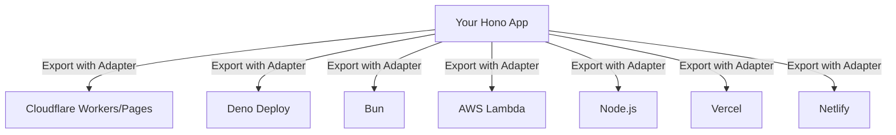

This section covers Runtime Adapters and Deployment, allowing users to configure and deploy their web applications to edge and server runtimes such as Cloudflare Workers/Pages, Deno, Bun, AWS Lambda, Vercel, Netlify, and Node.js. It's designed for users who have built their app using core features like [Routing](routing) and [Middleware](middleware) and are now ready to go live in production environments. Adapters handle platform-specific requirements like event handlers, environment bindings, and static asset serving. For local testing before deployment, refer to [Running the App](running-the-app). For static assets integration, see [Static Files and Assets](static-files-and-assets).

## Overview
Runtime adapters bridge your application to deployment platforms by providing the correct export format (e.g., a **fetch** handler), environment access (e.g., secrets and storage), and static file support. Key capabilities include:
- Automatic handling of platform events and requests.
- Binding environment variables for secrets, databases, and storage.
- One-command deploys via platform CLIs or Git integration.
- Support for serverless (edge) and traditional server runtimes.

Users select an adapter based on their target platform, update their entry file with the adapter's export, define bindings in platform dashboards or config files, and deploy.

## Cloudflare Workers and Pages
Deploy to Cloudflare's global edge network for low-latency, serverless execution. Use the Cloudflare adapter to export your app as a **fetch** handler compatible with Workers (module mode) or Pages Functions.

### Key Actions
1. In your entry file (e.g., `index.ts`), import the adapter and export `default` as your app.
2. Define **Bindings** in the Cloudflare dashboard (e.g., KV namespaces, R2 buckets, D1 databases).
3. Run `npx wrangler deploy` or push to Git for Pages.
4. Access environment data via `c.env()` in handlers.

For static files, enable **serveStatic** with a manifest from `wrangler.toml`.

| Field | Required | Accepted Values | Description |
|-------|----------|-----------------|-------------|
| **KV Namespace** | No | Cloudflare KV binding name | Key-value store accessed via `c.env.KV_NAMESPACE.get(key)`. |
| **R2 Bucket** | No | Cloudflare R2 binding name | Object storage via `c.env.R2_BUCKET.put(key, value)`. |
| **D1 Database** | No | Cloudflare D1 binding name | SQL database via `c.env.DB.prepare(query).all()`. |

| Setting | Default | Options | What It Controls |
|---------|---------|---------|------------------|
| **Static Manifest** | None | Path to `__STATIC_CONTENT_MANIFEST` | Enables serving assets from `/static/*`; required for Workers. |
| **Service Worker Mode** | Module mode | Legacy `app.fire()` | Use module exports for new deploys; avoids static serving limits. |

> [!NOTE] Bindings are configured in `wrangler.toml` under `[vars]` or dashboard; they appear as properties on `c.env`.

## Server Runtimes (Deno, Bun, Node)
These adapters support traditional server environments with HTTP serving. Export a server instance or handler, then run via each runtime's CLI.

### Deno
1. Import Deno adapter.
2. Export `default` as your app's **fetch** handler.
3. Deploy with `deno deploy` or run locally with `deno run --allow-net`.
4. Environment vars via `Deno.env.get('KEY')` or bindings.

### Bun
1. Import Bun adapter with **serveStatic** support.
2. Export server via `serve({ fetch: app.fetch, port: 3000 })`.
3. Run `bun run index.ts`; supports `bun --watch` for dev.

### Node.js
1. Import Node adapter (e.g., for Express-like serving).
2. Export `default` as app or use `serve(app)`.
3. Run `node index.js` or via PM2/forever; multiple Node versions supported.

| Platform | Handler Export | Environment Access | Static Serving |
|----------|----------------|---------------------|---------------|
| **Deno** | `export default app` (fetch) | `Deno.env.get()` or bindings | Via adapter middleware |
| **Bun** | `serve({ fetch: app.fetch })` | `process.env.KEY` | Built-in `serveStatic({ root: './static' })` |
| **Node** | `export default app` or `serve(app)` | `process.env.KEY` | Via adapter `serveStatic` |

## Other Platforms
### AWS Lambda / Lambda@Edge
Export as Lambda handler: `export const handler = eventHandler(app)`. Bind env vars in AWS console. Deploy via `esbuild` or Serverless Framework. Supports API Gateway v2 events.

### Vercel / Netlify
Use Vercel adapter: export `default` as config with `{ api: { bodyParser: false } }`. Git push triggers deploy. Environment vars set in platform dashboards. Netlify uses similar Functions export.

| Platform | Deployment Command | Env Binding Example |
|----------|--------------------|---------------------|
| **AWS Lambda** | AWS CLI or Serverless | `process.env.MY_SECRET` |
| **Vercel** | `vercel --prod` | Dashboard vars accessible via `c.env.VERCEL_*` |
| **Netlify** | `netlify deploy --prod` | `process.env.NETLIFY_*` |

> [!WARNING] Lambda@Edge has size limits (1MB unzipped); minify assets and avoid large deps.

## Configuration Reference
Global options apply across adapters:

| Setting | Default | Options | What It Controls |
|---------|---------|---------|------------------|
| **Bindings Type** | `{}` | Custom interface (e.g., `{ DB: D1Database }`) | Typesafe access to `c.env.DB`. |
| **Static Root** | `./static` | File path | Directory for asset serving. |
| **Port** | `3000` | Number | Listening port for server runtimes. |

## Troubleshooting
Common issues from deployment logs:

| Message | Severity | Meaning |
|---------|----------|---------|
| "No default export found" | Error | Entry file missing `export default app`; add adapter export. |
| "Binding 'KV' not found" | Error | Environment binding missing in platform dashboard; create and redeploy. |
| "Static manifest required" | Warning | Cloudflare Workers needs `__STATIC_CONTENT_MANIFEST`; generate via Wrangler build. |
| "Port already in use" | Warning | Server runtime conflict; change **Port** setting or kill process. |

## Summary
- Use runtime adapters to export your app for seamless deployment to Cloudflare Workers/Pages, Deno, Bun, Node.js, AWS Lambda, Vercel, or Netlify.
- Configure **Bindings** in platform dashboards for `c.env` access to storage and secrets.
- Enable static serving via adapter options like **Static Root**; see [Static Files and Assets](static-files-and-assets).
- Test locally with [Running the App](running-the-app) before deploying.
- For advanced routing in deploys, review [Routing](routing) and [Middleware](middleware).

[Overview](overview) | [Getting Started](getting-started) | [Configuration Reference](configuration-reference)