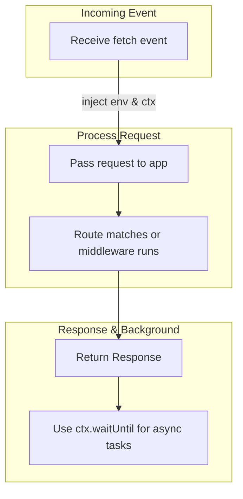

This section covers deploying and running Hono applications on Cloudflare Workers and Pages, Cloudflare's serverless platforms for edge computing and static sites with dynamic functions. It's designed for users building fast, globally distributed web apps who want zero-cold-start performance and seamless integration with Cloudflare services like KV storage, R2 object storage, and Durable Objects. This fits into the broader deployment story by providing a runtime adapter tailored to Cloudflare's event-driven model. For other platforms, see [Server Runtimes (Deno, Bun, Node)](server-runtimes-deno-bun-node). For serving static content alongside dynamic routes, see [Static Files and Assets](static-files-and-assets) and [Static Site Generation (SSG)](static-site-generation-ssg).

## Overview
Cloudflare Workers and Pages let you deploy Hono apps directly to the edge without managing servers. Workers handle full API and dynamic workloads via a **fetch** event, while Pages Functions add server-side logic to static sites via a **handle** event. Key capabilities include:
- Automatic access to environment **bindings** (e.g., secrets, KV namespaces).
- Execution **context** for background tasks and request passing.
- Optimized static asset serving from bundled **ASSETS**.
- Connection details like client IP and location via **conninfo**.

## Cloudflare Workers Deployment
Cloudflare Workers process incoming requests through a **fetch** event. Your app integrates by passing the event's **request**, **env**, and **ctx** to the app's main processing method.

### Event Structure
The **fetch** event provides these core inputs:

| Parameter | Description |
|-----------|-------------|
| **request** | Incoming HTTP request with headers, body, method, and URL. Passed directly to route handlers. |
| **env** | Environment bindings for services like KV, R2, D1 databases, or custom secrets. Access via typed generics for type safety. |
| **ctx** | Execution context for advanced control (see table below). |

| Context Method | Description | Usage Notes |
|----------------|-------------|-------------|
| **waitUntil** | Schedules background tasks that outlive the response (e.g., logging, cache updates). Promises can run after response is sent. |
| **next** | Passes the request to the next handler or Worker in a chain. Returns a Promise<Response>. |
| **passThroughOnException** | Configures behavior if an error occurs (default: false, terminates chain). |

> [!NOTE]  
> Use **env** bindings for production secrets—never hardcode them. Define types upfront for autocomplete and validation.

### Workflow: Handling a Fetch Event

## Cloudflare Pages Functions
Cloudflare Pages serves static sites with optional dynamic Functions triggered by a **handle** event. This processes **event** objects containing **request**, **env**, and **ctx**, similar to Workers.

### Key Differences from Workers
- Optimized for static-first sites; dynamic logic augments pre-built HTML/CSS/JS.
- **ASSETS** automatically bundle static files from your `/public` or configured directories.
- Use the **handle** method to integrate your app directly.

Event structure mirrors Workers: **request** for the path, **env** for bindings, **ctx** for execution (waitUntil, next).

> [!WARNING]  
> Pages Functions have execution limits (e.g., 10ms CPU on Free plan)—test thoroughly for compute-heavy routes.

## Serving Static Assets
Static files are bundled into **ASSETS** during build/deploy. Serve them efficiently without route conflicts.

### Configuration
Use the static serving middleware with an **ASSETS manifest** (auto-generated at build time).

| Setting | Default | Options | What It Controls |
|---------|---------|---------|------------------|
| **root** | `./static` | Any project-relative path | Base directory for assets. |
| **manifest** | None (required for ASSETS) | `__STATIC_CONTENT_MANIFEST` reference | Maps URLs to bundled asset keys; enables compression and caching. |
| **onNotFound** | None | Custom handler function | Callback for missing files (e.g., fallback to 404 page). |

Mount on paths like `/assets/*` or `/*` for SPA catch-all.

> [!NOTE]  
> ASSETS support automatic MIME types, ETag caching, and Range requests for resumable downloads.

## Accessing Connection Information (conninfo)
Cloudflare exposes rich client details via **conninfo** on the request.

| Field | Example Values | Description |
|-------|----------------|-------------|
| **remoteAddress** | `203.0.113.1` | Client IPv4/IPv6 address. |
| **tlsVersion** | `TLSv1.3` | TLS protocol version. |
| **cipher** | `TLS_AES_128_GCM_SHA256` | Negotiated cipher suite. |
| **country** | `US` | Two-letter country code (from `cf` headers). |
| **colo** | `LAX` | Edge data center code. |

Access these in handlers to log, rate-limit, or personalize (e.g., geo-based redirects).

## Configuration Reference
Global settings for Cloudflare adapters:

| Setting | Default | Options | What It Controls |
|---------|---------|---------|------------------|
| **basePath** | `/` | Custom prefix (e.g., `/api`) | Rewrites incoming paths for subpath deploys. |
| **manifest** | Auto-detected | Explicit ASSETS manifest | Static file resolution on Pages/Workers. |

Define **env** types at app creation for bindings like `KV_MYSTORE: KVNamespace`.

## Troubleshooting
Common issues and messages observed in Cloudflare logs or browser console:

| Message | Severity | Meaning |
|---------|----------|---------|
| "No route matched" | Info | Request path doesn't hit any defined route. Check path params and middleware order. |
| "Asset not found in manifest" | Warning | Static file missing from ASSETS bundle. Verify file paths and rebuild/deploy. |
| "waitUntil promise rejected" | Error | Background task failed post-response. Review async code in ctx.waitUntil. |
| "Execution timeout" | Error | CPU/timeout exceeded (Pages: 10ms Free). Optimize handlers or upgrade plan. |
| "Binding not found: *KV_*" | Error | Env binding missing in wrangler.toml or dashboard. Add and redeploy. |

> [!WARNING]  
> Failed **waitUntil** tasks don't affect the response but may cause data loss—always handle promise rejections.

## Summary
- Deploy to **Workers** via **fetch** with **request**, **env**, **ctx** for full dynamic apps.
- Use **handle** events on **Pages** for static + dynamic hybrids.
- Serve **ASSETS** with manifest for optimized static files; see [Static Files and Assets](static-files-and-assets).
- Access **conninfo** for client details like IP and TLS.
- Leverage **waitUntil**/**next** for background work; monitor logs for timeouts.

For full deployment workflows, see [Getting Started](getting-started) and [Runtime Adapters and Deployment](runtime-adapters-and-deployment). For middleware integration, check [Middleware](middleware).