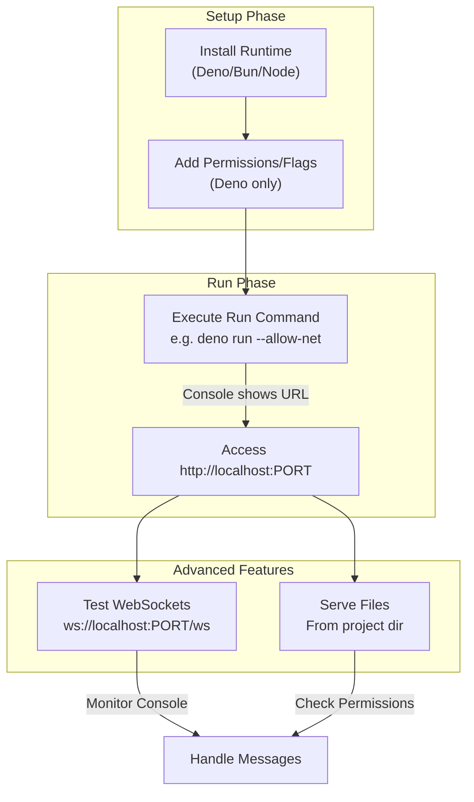

This section covers deploying and running Hono applications on native server runtimes including Deno, Bun, and Node.js. It's designed for users seeking full control over server environments, including native HTTP serving, real-time WebSocket connections, and direct file system operations for tasks like serving assets or reading configuration files. These runtimes offer more traditional hosting compared to edge platforms—see 8.1. Cloudflare Workers and Pages for serverless options. For creating the app structure that runs here, refer to [Getting Started](getting-started) and [Running the App](running-the-app); for advanced features like routing and middleware, see [Routing](routing) and [Middleware](middleware).

## Overview
Server runtimes enable hosting Hono apps locally or on dedicated servers with persistent processes, high-performance networking, and system-level access. Key capabilities include:
- Starting a development or production server on a specified port.
- Handling WebSocket upgrades for bidirectional communication.
- Reading/writing files for dynamic content, caching, or logging.
- Cross-platform compatibility with minimal configuration.

Users typically start the server via command-line tools, monitor console output for status, and access the app via browser or tools like curl.

## Deno
Deno provides a secure, TypeScript-native runtime with built-in permissions for network and file access.

### Starting the Server
1. Ensure Deno is installed (version 1.40+ recommended).
2. Open your terminal in the project directory.
3. Run the server with required permissions: use flags like **--allow-net** for HTTP/WebSockets, **--allow-read** for file access, and **--allow-write** for modifications.
4. Observe the console output showing the listening address, e.g., *Listening on http://0.0.0.0:8000*.

Access your app at the displayed URL. Stop the server with **Ctrl+C**.

### WebSocket Support
WebSockets upgrade automatically on supported routes. Connect clients via *ws://localhost:8000/ws*—the server handles pings, messages, and disconnections, logging events to the console.

### File System Access
Serve files from directories or read JSON configs dynamically. Permissions control access; denied operations show clear error messages like *Permission denied: read access*.

| Permission Flag | Required | Description |
|-----------------|----------|-------------|
| **--allow-net** | Yes | Enables HTTP serving and WebSocket listening. |
| **--allow-read** | For reads | Access static files, configs, or uploads. |
| **--allow-write** | For writes | Save logs, caches, or user data. |
| **--allow-env** | Optional | Read environment variables for ports or secrets. |

## Bun
Bun offers JavaScript speed with built-in bundling and a fast HTTP server.

### Starting the Server
1. Install Bun (version 1.0+).
2. In your project directory, run **bun run server.ts** (or **bun dev** for watch mode).
3. Console shows startup info like *Server running at http://localhost:3000*.

Supports hot reload in development; production runs are long-lived.

### WebSocket Support
Native upgrades on routes; clients connect to *ws://localhost:3000/ws*. Console logs connections and payloads.

### File System Access
Direct reads/writes without extra flags—serve directories or process uploads efficiently.

| Setting | Default | Options | What It Controls |
|---------|---------|---------|------------------|
| **Port** | 3000 | Any unused port | Listening address for HTTP/WebSockets. |
| **Watch Mode** | Off | *true*/*false* | Auto-restarts on file changes (dev only). |

## Node.js
Node.js provides mature ecosystem support for production servers.

### Starting the Server
1. Install Node.js (v18+; tested on 18, 20, 22).
2. Install dependencies with **npm install** or equivalent.
3. Run **node server.js**.
4. Console displays *Server listening on port 3000*.

Use process managers like PM2 for production.

### WebSocket Support
Upgrades via standard routes; connect to *ws://localhost:3000/ws*. Integrates with libraries for pub/sub.

### File System Access
Uses built-in modules for synchronous/asynchronous reads—ideal for assets or databases.

| Runtime Comparison | Deno | Bun | Node.js |
|--------------------|------|-----|---------|
| **Startup Command** | *deno run --allow-net* | *bun run* | *node* |
| **WebSocket Native** | Yes | Yes | Yes (with compat) |
| **FS Permissions** | Explicit flags | Automatic | Node APIs |
| **Best For** | Secure dev | Speed | Ecosystem |

## Configuration
Customize via environment variables or startup flags:

| Setting | Default | Options | What It Controls |
|---------|---------|---------|------------------|
| **PORT** | 8000 (Deno), 3000 (others) | Integer | Server bind port. |
| **HOST** | *0.0.0.0* | IP/address | Binding interface (localhost for dev). |
| **DENO_IMPORT_MAP** | None | JSON path | Module resolution (Deno only). |

## Troubleshooting
Common issues appear in console output.

| Message | Severity | Meaning |
|---------|----------|---------|
| *Permission denied (read/write/net)* | Error | Missing Deno flags—add **--allow-read**, **--allow-net**, etc., and restart. |
| *EADDRINUSE: address already in use* | Error | Port occupied—change **PORT** or kill conflicting process. |
| *WebSocket connection failed* | Warning | Client mismatch or firewall—verify *ws://* URL and server logs. |
| *Module not found* | Error | Dependency issue—run install/reinstall for Bun/Node, or check Deno cache. |

> [!NOTE] For Bun/Node, ensure dependencies are installed before running. Deno requires explicit permissions for security.

> [!WARNING] Exposing **HOST** as *0.0.0.0* in production opens to all networks—use firewalls.

## Summary
- Run Hono apps on **Deno**, **Bun**, or **Node.js** for native servers with WebSocket and file system support.
- Use runtime-specific commands and flags for startup; configure **PORT** and **HOST** as needed.
- Troubleshoot permissions and ports via console messages.
- Compare runtimes in the table for your needs; extend with [WebSockets](websockets) details or [Static Files and Assets](static-files-and-assets) for SSG.
- For deployment beyond local, see [Runtime Adapters and Deployment](runtime-adapters-and-deployment); start apps via 2.3. Running the App.