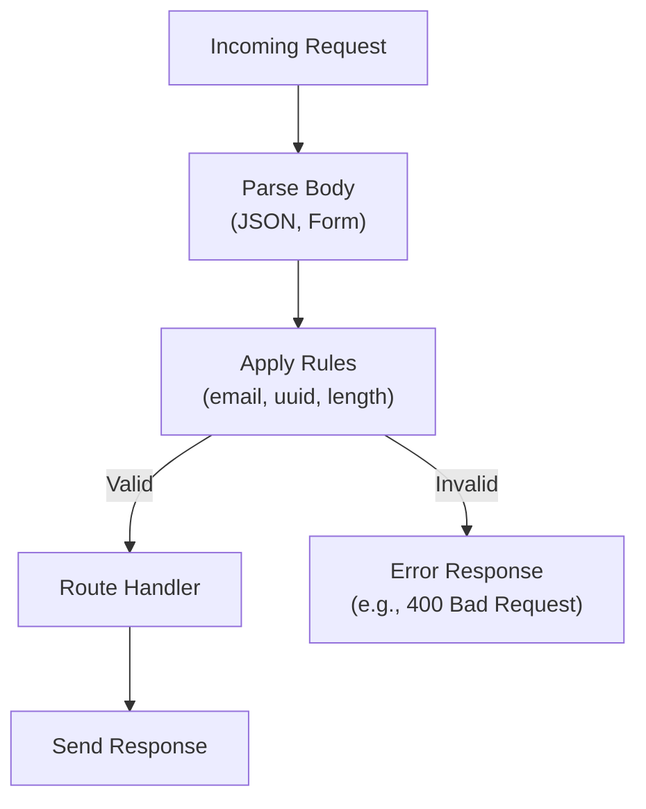

This section covers the built-in utilities and validation helpers in Hono, designed for app developers to simplify common tasks like client-side API calls, request body parsing, cookie handling, CSRF protection, and input validation. These tools integrate seamlessly with routes, middleware, and responses to make your applications more secure and efficient. For using them in route handlers, see [Routing](routing). For applying them as middleware, see [Middleware](middleware). For client-side interactions with your server, combine with [Rendering Responses](rendering-responses).

## Overview
Hono provides lightweight utilities for parsing incoming requests (such as JSON or form data), managing cookies, generating client proxies for type-safe API calls, protecting against CSRF attacks, and validating inputs. These helpers appear as methods on the request context (**c.req**) in your handlers or as standalone middleware functions. They handle data extraction, formatting, and security checks automatically, producing structured outputs or throwing user-friendly errors if validation fails.

## Client-Side Fetching
Use the client proxy to make type-safe requests from the browser or other clients to your Hono app's routes. It supports path parameters, query strings, form data, JSON bodies, cookies, and headers, mimicking your route structure.

### Making Requests
1. Initialize the client with your app's **base URL**, such as *https://api.example.com*.
2. Access routes using dot notation, e.g., **users.list()** or **posts.create()**.
3. Provide inputs via an object with **query**, **param**, **form**, **json**, **cookie**, or **header**.
4. Call **fetch()** on the result to send the request; it returns a standard **Response** object.
5. For WebSocket routes, use **ws()** with query or params to get a connectable URL.

> [!NOTE]  
> The client automatically builds URLs, serializes bodies (FormData for forms, JSON for objects), sets **Content-Type**, and appends cookies as **Cookie** headers.

| Input Type | Required | Accepted Values | Description |
|------------|----------|-----------------|-------------|
| **query** | No | Object of key-value pairs (strings or arrays) | Appends as URL search params, e.g., `{ page: '1', tags: ['a', 'b'] }` → `?page=1&tags=a&tags=b`. |
| **param** | No | Object of path param replacements, e.g., `{ id: '123' }` | Replaces `:id` in route paths. |
| **form** | No | Object of strings, numbers, or arrays | Builds FormData; skips undefined values. |
| **json** | No | Any serializable object | Stringifies to JSON body; sets **Content-Type: application/json**. |
| **cookie** | No | Object of key-value pairs | Serializes as **Cookie** header with path `/`. |
| **header** | No | Object of string headers | Merges into request headers. |

### WebSocket Connections
1. Access the WS route, e.g., **chat.room.join()**.
2. Pass **query** or **param** in the input object.
3. Use the returned URL with your WebSocket client.

## CSRF Protection
Apply CSRF middleware to routes to block cross-site forgery attacks on unsafe methods (POST, PUT, etc.) with form-like content types. It checks **Origin** and **Sec-Fetch-Site** headers, allowing requests only if at least one passes validation.

### Applying the Middleware
1. Add the middleware to paths, e.g., `app.use('/forms/*', csrf(options))`.
2. Configure via **origin** or **secFetchSite** options.
3. On failure, it returns a **403 Forbidden** response.

> [!WARNING]  
> Only applies to non-GET/HEAD methods with form-encoded **Content-Type**. Safe methods (GET, HEAD) always pass.

| Setting | Default | Options | What It Controls |
|---------|---------|---------|------------------|
| **origin** | Same as request URL | String (e.g., *https://example.com*), array of strings, or function `(origin, context) => boolean` | Validates **Origin** header; denies if missing or mismatched. |
| **secFetchSite** | *same-origin* | String (e.g., *same-site*), array (e.g., [*same-origin*, *cross-site*]), or function `(value, context) => boolean` | Validates **Sec-Fetch-Site** header values (*same-origin*, *same-site*, *none*, *cross-site*); denies if missing or invalid. |

## Request Parsing and Cookies
In route handlers, parse bodies and access cookies directly from **c.req**.

### Body Parsing
- **JSON**: Use **c.req.json()** → returns parsed object or throws if invalid.
- **Form**: Use **c.req.parseBody()** → returns FormData-like object.
- Supports URL-encoded, multipart, and plain text.

### Cookies
- **c.req.cookie(key)**: Gets value for *key* or *undefined*.
- Set via **c.cookie(key, value, options)** in responses.

## Validation
Built-in rules check common formats during parsing or via custom schemas. Invalid inputs trigger errors with details like "Invalid email" or "UUID too short".

| Rule | Accepted Values | Error Output |
|------|-----------------|--------------|
| *email* | RFC 5322-compliant strings | "Must be a valid email address" |
| *uuid* | UUID v4 strings (e.g., *550e8400-e29b-41d4-a716-446655440000*) | "Must be a valid UUID" |
| *length(min, max)* | Strings/numbers in range | "Length must be between *min* and *max*" |

## Workflow: Handling a Validated Request

## Troubleshooting

| Message | Severity | Meaning |
|---------|----------|---------|
| Forbidden (403) | Error | CSRF check failed—verify **Origin** or **Sec-Fetch-Site** matches allowed values. Adjust middleware options. |
| Invalid email/UUID/length | Error | Input failed validation rules. Check field formats and resubmit. |
| No body parser match | Warning | **Content-Type** not recognized—ensure JSON/form headers are set correctly. |

## Summary
- Use client proxy for type-safe fetches with **query**, **param**, **form**, **json**, **cookie** inputs.
- Protect forms with **csrf()** middleware, configuring **origin** and **secFetchSite**.
- Parse requests via **c.req.json()**, **c.req.parseBody()**, and **c.req.cookie()**.
- Validate with rules like *email*, *uuid*, *length* for secure inputs.
For advanced security, see [Middleware](middleware). For route integration, see [Routing](routing). For deployment considerations, see [Runtime Adapters and Deployment](runtime-adapters-and-deployment).