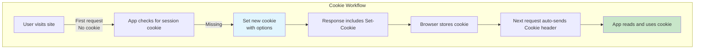

This section covers Request Parsing and Cookies, essential utilities for extracting and managing data from incoming HTTP requests in your web applications, including query parameters, form submissions, JSON payloads, headers, and persistent cookies. It's designed for users building dynamic sites and APIs that handle user interactions and maintain state across sessions. These features integrate directly with [Routing](routing) to process data in specific paths and [Middleware](middleware) for pre-response handling. For broader input validation, explore other tools in [Utilities and Validation](utilities-and-validation). See [Configuration Reference](configuration-reference) for related global options.

## Overview
Request Parsing provides straightforward access to common request components, allowing your application to respond intelligently to user inputs like search terms, login forms, or API data. Cookie management enables secure storage of user preferences, sessions, or tokens on the client side. Together, they support everything from simple forms to complex APIs without manual string manipulation.

## Query Parameters
Query parameters are appended to URLs (e.g., `/search?q=term&sort=asc`), commonly used for filtering lists, pagination, or optional settings.

- Users enter these via browser address bars, links, or form **GET** submissions.
- Your application retrieves them as a key-value map.
- Values are strings by default; handle arrays for repeated keys (e.g., `?tags=js&tags=ts`).

> [!NOTE]  
> Query parameters are visible in URLs, ideal for bookmarkable, shareable links but not for sensitive data.

## Form Data Parsing
Handles data from HTML `<form>` submissions, supporting both **URL-encoded** (simple key-value) and **multipart** (file uploads) formats.

- Triggered on **POST** or **PUT** requests with `Content-Type: application/x-www-form-urlencoded` or `multipart/form-data`.
- Parsed into a map of fields, with files accessible separately.
- Required for login forms, contact submissions, or file uploads.

| Field Type | Required | Accepted Values | Description |
|------------|----------|-----------------|-------------|
| **Text fields** | No | Strings up to ~2KB | User-entered text like names or emails |
| **File uploads** | No | Files (images, docs, etc.) | Binary data with original filename and MIME type |
| **Checkboxes** | No | *on* or empty | Boolean-like for selections |
| **Multi-select** | No | Array of strings | Multiple values from `<select multiple>` |

## JSON Parsing
Processes structured data from API requests with `Content-Type: application/json`.

- Expects valid JSON objects, arrays, or primitives.
- Parsed into native data structures for easy use.
- Common for RESTful APIs, single-page app updates, or mobile backends.

> [!WARNING]  
> Invalid JSON triggers parsing errors—always validate inputs to avoid crashes.

## Headers Access
Headers provide metadata like authentication tokens, user agents, or content preferences.

- Standard headers: **User-Agent**, **Authorization**, **Content-Type**.
- Custom headers: prefixed with `X-` (e.g., **X-API-Key**).
- Case-insensitive lookup; multi-value headers return arrays.

## Cookie Management
Cookies store small (<4KB) client-side data, automatically sent with matching requests.

### Reading Cookies
- Incoming requests include a **Cookie** header with name-value pairs.
- Retrieve specific cookies by name for session checks or personalization.

### Setting Cookies
- Attach to responses via **Set-Cookie** header.
- Specify name, value, expiration, path, domain, and security flags.
- Workflow:
  1. Identify the cookie **Name** and **Value**.
  2. Set optional expiration (date or *max-age* in seconds).
  3. Apply security options (see table below).
  4. Send in response—browser stores and returns on future requests.

### Deleting Cookies
- Set **Max-Age** to `0` or past expiration.
- Match exact **Path** and **Domain** for removal.

| Setting | Default | Options | What It Controls |
|---------|---------|---------|------------------|
| **secure** | *false* | *true*, *false* | Restricts transmission to HTTPS only, preventing man-in-the-middle attacks |
| **httpOnly** | *false* | *true*, *false* | Blocks access via JavaScript (`document.cookie`), reducing XSS risks |
| **sameSite** | *lax* | *strict*, *lax*, *none* | *strict*: No cross-site sends; *lax*: Safe methods only; *none*: All (requires **secure**) |

## Summary
- Extract query parameters, form data, JSON, and headers effortlessly for responsive apps.
- Manage cookies securely with options like **secure**, **httpOnly**, and **sameSite** for stateful experiences.
- Integrates with [Routing](routing) for path-specific parsing and [Middleware](middleware) for chainable processing.
- For deployment considerations, see [Runtime Adapters and Deployment](runtime-adapters-and-deployment); for input shaping, check [Utilities and Validation](utilities-and-validation).