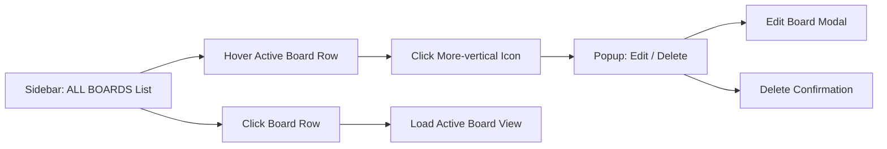

The Dashboard serves as the primary workspace interface, providing quick access to your boards, task creation, and essential app controls. It displays the active board in the main content area, with a collapsible sidebar for switching between boards and a fixed header for global actions like adding tasks, toggling themes, or entering fullscreen mode. This layout keeps your workflow efficient, allowing seamless navigation without leaving the screen.

## Sidebar Board List

The sidebar appears as a fixed panel on the left side of the screen (width about 14rem), listing all available boards. It is visible by default on larger screens but can be toggled hidden/shown via a button. On smaller screens (under 700px width), it starts hidden if no boards exist and can be revealed using the expand button (a sidebar collapse icon) positioned fixed at the top-left.

### What You See
- **ALL BOARDS (X)**: A label at the top showing the total number of boards, where *X* is the count.
- **Board items**: Each board displays as a clickable row with:
  - A board icon.
  - Board name followed by *(Y)* indicating the number of columns.
  - The active board is highlighted with a primary color background and white text.
  - Hovering reveals a more-vertical icon on the right.
- **Add New Board**: A button at the bottom with a + icon and label, only shown if a workspace profile is set.
- **Hide Sidebar** button: At the bottom-right of the sidebar, with a sidebar expand icon.

### Actions and Controls
| Control | Description | Behavior |
|---------|-------------|----------|
| **Board row** | Click any board name/icon. | Switches to that board as the active one; updates the main content area. Sidebar closes if toggled on mobile. |
| **More-vertical icon** (appears on hover, only for active board when menu open) | Click to open a popup menu. | Shows options: **Edit Board** (opens edit modal), **Delete Board** (opens confirmation modal). Menu closes after selection. |
| **Add New Board** | Click the button. | Opens a modal for creating a new board. On mobile, it may trigger a mobile-specific handler. |
| **Hide Sidebar** | Click the button. | Collapses the sidebar (slides left); reveal button appears outside. |

> [!NOTE]  
> If no boards exist, the sidebar shows empty except for **Add New Board**. The main area prompts setup via other flows like [Managing Boards](managing-boards).

### Workflow: Switching Boards
1. Ensure the sidebar is visible (click the expand button if hidden).
2. Locate the desired board in the list.
3. Click the board name or icon.
4. The selected board becomes active; its details load in the main area.

### Workflow: Accessing Board Options
1. Switch to the target board to make it active.
2. Hover over the active board row to reveal the more-vertical icon.
3. Click the icon to open the popup.
4. Select **Edit Board** or **Delete Board**; a modal opens for confirmation/action (see Managing Boards|4.2 Editing and Deleting Boards).

## Header Controls

The header is a fixed bar at the top (65px height) spanning the full width, with a subtle border. It includes branding, workspace info, and right-side action buttons. Available only after workspace setup.

### What You See
- **Logo**: Kanban icon on desktop (left, hidden on mobile); mobile shows a small logo image.
- **Workspace dropdown**: Shows workspace **name** (truncated if long) with a down-chevron icon.
- Right-side icons/buttons:
  - Fullscreen toggle (screen-full or zoom-out icon, changes state).
  - Theme toggle switch.
  - **Add Task** button (round primary color, + icon on mobile or "+ Add Task" text on desktop); hidden if no active board or no columns.

### Actions and Controls
| Control | Description | Possible Values/States | Default/Requirement |
|---------|-------------|------------------------|---------------------|
| **Workspace name + chevron** | Click to toggle dropdown. | N/A (required: workspace profile). | Shows current workspace name. |
| **Fullscreen button** | Click to toggle fullscreen mode. | *Fullscreen icon* (enter) or *zoom-out icon* (exit). | Off by default. |
| **Theme toggle** | Switch for light/dark mode. | *Light* or *Dark*. | Matches local storage (dark if unset). |
| **Add Task** | Click to open task creation. | Visible only if active board has columns. | N/A. |

### Popup Menus
- **Workspace dropdown popup**:
  - Profile preview: Workspace image, **name**, *email*.
  - Menu items: **Invite people to [name]** (inactive), **Workspace settings** (inactive), **Switch workspace** (navigates to workspace selector).
- Popup positioned below/near trigger; closes on selection or outside click.

### Workflow: Adding a Task
1. Ensure an active board with columns is loaded.
2. Click **+ Add Task** in the header.
3. A modal opens for task details (see Creating and Managing Tasks|6.1 Adding Tasks).

### Workflow: Managing Workspace
1. Click the workspace **name** + chevron.
2. View profile preview.
3. Select **Switch workspace** to change (redirects to selector).

> [!WARNING]  
> **Add Task** is unavailable until you create a board with columns (Managing Columns|5.1 Adding Columns).

## Log Messages

During operation, you may observe messages in the browser console (press F12 to view). These indicate normal behavior or setup states.

| Message | Severity | Meaning |
|---------|----------|---------|
| "see" | Info | Appears briefly on mobile/small screens (under 700px) when no boards exist; the sidebar is automatically hidden to optimize space. No action needed—create a board to populate the list. |

## Related Features
- Sidebar actions link to [Managing Boards](managing-boards) for creation/editing.
- **Add Task** integrates with task modals and the active board's columns.
- Board switching updates the main view, affecting [Task Details and Subtasks](task-details-and-subtasks).
- Fullscreen and theme apply app-wide; workspace switch exits to Getting Started|2.2 First Workspace Setup.