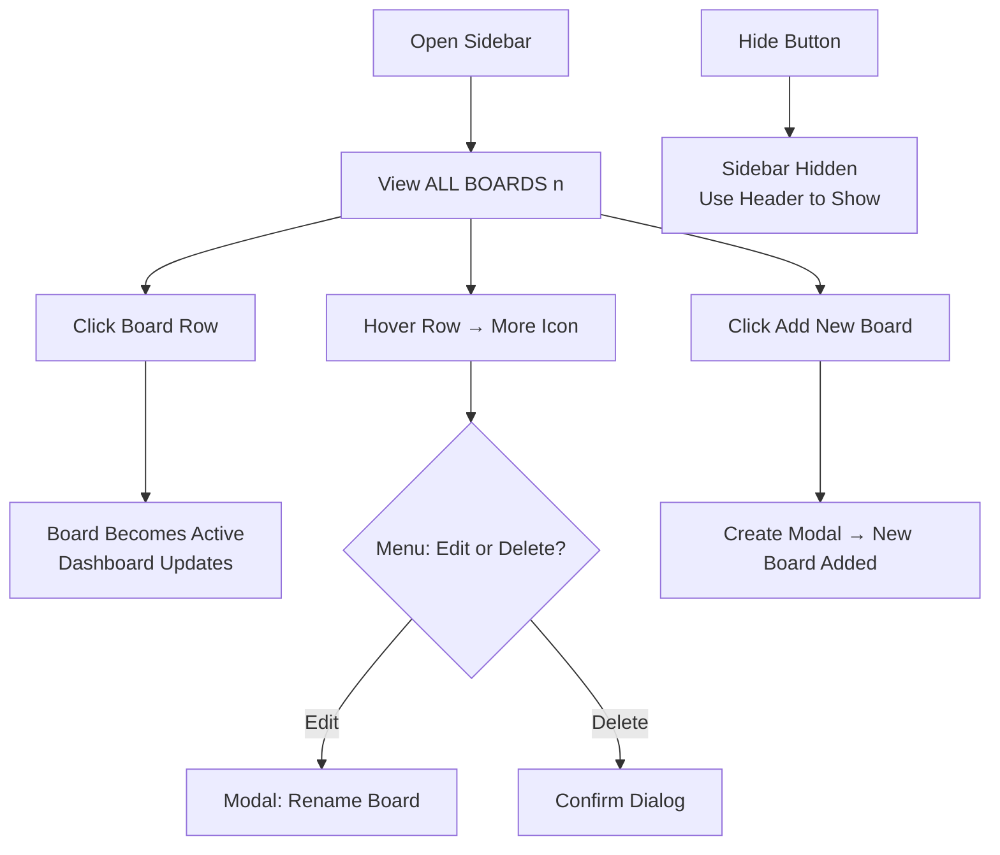

The Sidebar Board List is your central hub for navigating between boards in the app. It displays all available boards with their names and column counts, allows quick selection of the active board, and provides options to add, edit, or delete boards. This feature helps you stay organized by giving an at-a-glance overview of your workspace and enabling seamless switching without disrupting your workflow. The sidebar appears as a vertical panel on the left side of the screen, which can be hidden to maximize workspace area, especially useful on smaller screens.

## Sidebar Layout and Display
The sidebar occupies the left edge of the app window and includes:

- A header label **ALL BOARDS (n)**, where *n* is the total number of boards you have created. This count updates automatically as boards are added or deleted.
- A scrollable list of individual boards, each shown as a clickable row.
- An **Add New Board** button at the bottom (visible only after initial workspace setup).
- A **Hide Sidebar** button positioned at the top-right corner of the sidebar panel.

On wider screens (desktop or tablet), the sidebar remains persistently visible with a subtle right border. On narrower screens (mobile or small windows), it slides in from the left as an overlay and can be toggled.

Each board row in the list shows:
- A board icon.
- The board's *name* (e.g., "Roadmap" or "Project Alpha").
- The column count in parentheses, e.g., **Roadmap (4)**, indicating how many columns are currently in that board.

The currently *active board* is highlighted with a colored background on the right side and white text for easy identification.

| Display Element | Description | Updates When |
|-----------------|-------------|--------------|
| **ALL BOARDS (n)** | Total count of all boards in your workspace. | Boards are created, edited, or deleted. |
| **Board Name (m)** | Name of the board followed by its column count (*m*). | Board renamed or columns added/removed. |
| Board icon | Visual indicator next to each board name. | Never changes. |
| Highlighted row | Active board gets a distinct colored right-rounded background and white text. | You select a different board. |

## Selecting a Board
Switching boards updates the main workspace to show the selected board's columns and tasks.

1. Locate the desired board in the list.
2. Click the board row (name and count area).
3. The selected board becomes the *active board*, highlighted in the list.
4. The main dashboard refreshes to display that board's columns and tasks.
5. On mobile views, the sidebar automatically hides after selection.

> [!NOTE]  
> Only one board can be active at a time. Selecting a new board does not affect data in other boards.

## Board Menu Options
Hover over any board row to reveal a *more options* icon (three vertical dots) on the right. This menu appears only on hover and is available for the active board.

Click the *more options* icon to open a dropdown popup with these actions:

| Menu Option | What It Does | Requirements |
|-------------|--------------|--------------|
| **Edit Board** | Opens a modal dialog to rename the board. The current name is pre-filled. | Board must be active. |
| **Delete Board** | Opens a confirmation dialog showing the board's name. Confirm to permanently remove the board and all its columns/tasks. | Board must be active; cannot delete the last board if no others exist. |

- After choosing an option, the menu closes automatically.
- These actions connect to 4.1. Creating a Board for editing (uses the same form) and deletion workflows in 4.2. Editing and Deleting Boards.

## Adding a New Board
The **Add New Board** button enables quick board creation.

1. Click **Add New Board** at the bottom of the sidebar.
2. A modal dialog opens with a form to enter the new board *name* (required, text only, no length limit specified but kept short for usability).
3. Fill in the **Board Name** field.
4. Click **Create Board** (or equivalent save button in the modal).
5. The new board appears in the list with (0) columns, becomes the active board, and the modal closes.
6. The total **ALL BOARDS (n)** count increments.

If no workspace profile is set up, this button is hidden—complete 2.2. First Workspace Setup first.

This links directly to the full creation process in 4.1. Creating a Board.

## Hiding and Showing the Sidebar
Control sidebar visibility to focus on the dashboard.

1. Click the **Hide Sidebar** button (expand arrow icon) in the top-right of the sidebar.
2. The sidebar slides out of view, expanding your workspace.
3. To show it again:
   - On desktop: Use a show toggle in the header (see 3.2. Header Controls).
   - On mobile: Tap a dedicated menu icon in the header to slide it back in.

> [!WARNING]  
> Hiding the sidebar does not affect board data or selection—it only changes visibility. Always verify the active board label in the header before making changes.

## Related Features and Workflows
- **Board counts** reflect column totals, linking to 5. Managing Columns—adding columns updates the display instantly.
- Active board selection drives the dashboard view, integrating with 6. Creating and Managing Tasks and 7. Task Details and Subtasks.
- Use this sidebar before 8. UI Customization and Controls for theme or layout tweaks.

