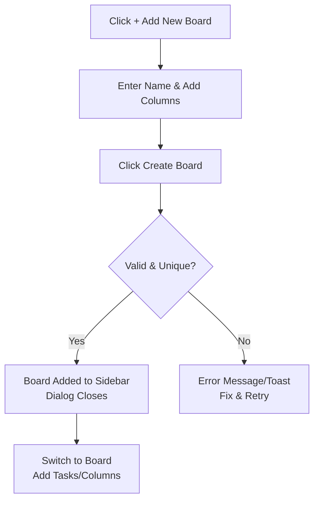

Creating a board allows you to set up a new customizable workspace for organizing tasks across columns, such as "Todo," "In Progress," and "Done." This is essential for project management, team collaboration, or personal task tracking, as each board starts with a unique name and at least one column to hold tasks. The creation process happens in a dedicated dialog that ensures valid input before adding the board to your list.

## Opening the Create Board Dialog
To begin creating a board:
1. Navigate to the main dashboard or sidebar where your existing boards are listed (see 3.1 Sidebar Board List).
2. Click the **+ Add New Board** button (typically found in the header or sidebar).
3. A modal dialog opens titled **Add New Board**, containing the form fields and controls described below.

## Form Fields and Controls
The dialog features a scrollable form with two main sections: board name and columns. All fields are validated on submission, with error messages appearing inline below the relevant field or section.

| Field/Control | Description | Required? | Accepted Values/Format | Default | What Happens on Change |
|---------------|-------------|-----------|-------------------------|---------|-----------------------|
| **Name** | A text input for the board's display name, shown in the sidebar and header. | Yes | 5-15 characters; letters, numbers, spaces, and common symbols (e.g., "Development", "Marketing Team"). | Empty | Updates the board name preview; triggers validation on submit. |
| **Columns** section | A dynamic list of text inputs for initial column names (e.g., "Todo", "Progress", "Done"). Columns organize tasks visually on the board. | Yes (at least 1) | Each column name: any non-empty text string. | None (empty list) | List expands/contracts as you add/remove columns. |
| **+ Add New Column** button | Blue button below the columns list. | No | N/A | N/A | Adds a new blank column input to the list. |
| **Create Board** button | Full-width primary button at the bottom. | N/A | N/A | N/A | Submits the form (see workflows below). |

> [!NOTE]  
> Column inputs include a remove icon (typically an "x" button) next to each one, allowing you to delete unwanted columns before submission.

### Validation Errors
If the form is invalid when submitted, inline error messages appear:
- **Required** under empty **Name** or column name fields.
- **At least 5 characters and not more than 15** under **Name** if length is invalid.
- **Add a column.** under the **Columns** section if no columns are present.

## Step-by-Step: Creating a New Board
1. In the **Add New Board** dialog, enter a unique name in the **Name** field (5-15 characters).
2. Under **Columns**, click **+ Add New Column** to add your first column, then fill in its name (e.g., "Todo").
3. Add more columns as needed by repeating step 2, and remove any extras using the "x" button.
4. Ensure at least one column is present and named.
5. Click **Create Board**.
6. The dialog closes, and the new board appears in the sidebar list (3.1 Sidebar Board List). You can immediately switch to it via the sidebar or header.

## Expected Results and Notifications
- **Success**: The board is added to your workspace. No confirmation message is shown beyond the dialog closing—check the sidebar for the new entry. Switch to the board to start adding tasks (6.1 Adding Tasks).
- **Duplicate Name**: A red toast notification appears at the top: **Board already exist.** The dialog remains open—change the **Name** and try again.
- **Invalid Form**: Errors highlight in red; fix them and resubmit.

## Related Features
- Newly created boards integrate with 5. Managing Columns for further additions/edits and 6. Creating and Managing Tasks for populating them.
- To modify a board after creation, use the edit option from the sidebar (4.2 Editing and Deleting Boards), which opens a similar dialog pre-filled with existing details.
- Boards are listed and selectable in the 3.1 Sidebar Board List and 3.2 Header Controls.

