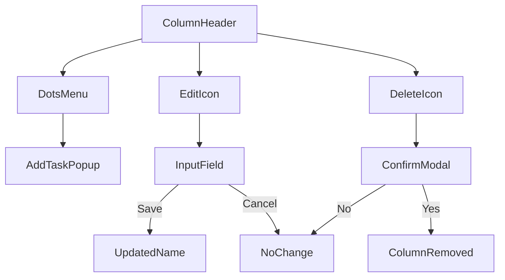

Managing columns in your board allows you to customize the workflow stages by editing names for clarity, removing unused columns (with a warning about permanently deleting associated tasks), and viewing task counts at a glance. Each column represents a stage like "To Do" or "In Progress," helping you organize tasks visually. Column headers display a color indicator, the name, and the number of tasks, making it easy to track progress across your board.

## Column Header Elements

Column headers appear at the top of each column and provide key information and quick actions. Here's what you'll see:

| Element          | Description                                                                 | Behavior |
|------------------|-----------------------------------------------------------------------------|----------|
| **Color Dot**    | A small colored circle next to the column name, automatically assigned based on column position (e.g., first column blue, second green). | Indicates column order; colors cycle through a predefined palette. |
| **Name**         | The column's label, shown in uppercase with truncation if longer than 10 characters (e.g., "VERYLONGNAMEHERE" becomes abbreviated with ellipsis). | Editable; reflects the current stage name. |
| **Task Count**   | Number in parentheses, e.g., "(3)", showing how many tasks are in the column. | Updates automatically as tasks are added, moved, or deleted. |

## 5.1 Adding Columns

New columns are typically set up when 4.1. Creating a Board|creating a board, where you define initial columns. Once a board is active, you cannot add columns directly from the column header—instead, recreate or duplicate the board via the sidebar if more stages are needed. This keeps boards lightweight and focused.

> [!NOTE]  
> If your workflow requires dynamic columns, consider using multiple boards for complex projects, as each board supports a flexible set of columns.

## Viewing Column Task Counts

Task counts update in real-time:
1. Open a board from the 3.1. Sidebar Board List|sidebar.
2. Scan the header of each column—the count (e.g., "(5)") shows tasks currently assigned to that stage.
3. Counts change as you add tasks, drag them between columns, or delete them.

## 5.2 Editing Column Names

Rename columns inline to match your project's terminology, like changing "Todo" to "Backlog."

1. Hover over a column header to reveal action icons.
2. Click the **pencil icon** (edit button).
3. An input field replaces the name, pre-filled with the current name.
4. Type the new name (alphanumeric characters, spaces allowed; up to practical length, but kept short for display).
5. Click the **checkmark icon** to save or the **close icon (X)** to cancel.
   - Required: Name cannot be empty—if submitted empty, the input border turns red, and no change is saved. Enter text and try again.

Expected result: Name updates instantly across the board; truncation applies if over 10 characters. No impact on tasks.

> [!WARNING]  
> Edited names affect drag-and-drop targets—ensure team members are aware to avoid confusion.

## Deleting Columns

Deleting a column permanently removes it and *all tasks within it*. A confirmation dialog warns you of this.

1. Hover over the column header.
2. Click the **trash icon** (delete button, red-tinted).
3. A **Delete Column** modal appears with:
   - Confirmation message: Warns that all tasks in the column will be deleted.
   - **Cancel** button: Closes without action.
   - **Delete** button: Confirms removal.
4. Click **Delete** to proceed.

Expected result: Column and its tasks vanish from the board. Other columns remain unaffected.

> [!WARNING]  
> This action is irreversible—export tasks first via 6. Creating and Managing Tasks|task details if needed.

## Additional Column Actions

Click the **three dots icon** (vertical dots menu) in the header for more options:

| Menu Item | Action |
|-----------|--------|
| **Add Card** | Opens a popup to 6.1. Adding Tasks|add a new task directly to this column. |

## Column Workflow

## Related Features

- Columns integrate with 6. Creating and Managing Tasks|task management: Drag tasks between columns to update status.
- Customize board layout in 8. UI Customization and Controls for better visibility.
- View detailed stats in 7. Task Details and Subtasks|task details.