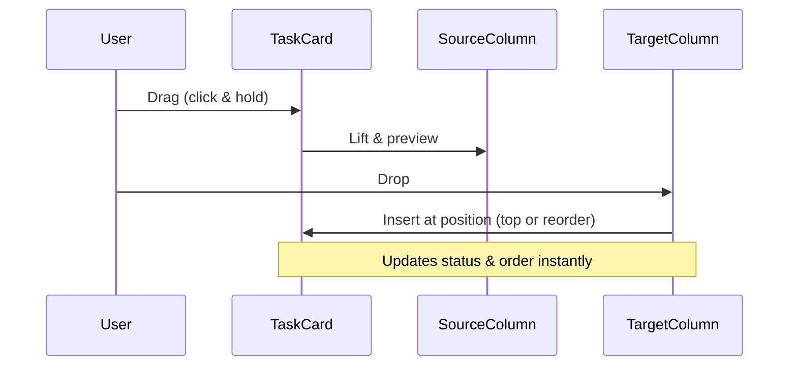

Tasks are the core building blocks of your board, representing specific work items assigned to columns like "Todo" or "In Progress." This section explains how to add new tasks via modals (opened from column headers or task cards), edit existing ones, delete them, and rearrange them using drag-and-drop for seamless workflow management. These actions help you organize priorities, track progress, and shift tasks between stages visually.

## 6.1 Adding Tasks

You can add tasks directly to a specific column using the **+ Add Task** button in a column header, or open a general add modal from the board header for choosing a column. A modal window appears with a form to enter task details. Tasks require at least a title and one subtask to ensure they are actionable.

### Task Creation Form Fields

| Field Name    | Description | Required? | Accepted Values/Format | Default | Behavior on Change |
|---------------|-------------|-----------|------------------------|---------|--------------------|
| **Title**    | Short name for the task, e.g., "Design landing page." | Yes | Any text up to reasonable length | Empty | Updates the task preview; triggers validation on submit. |
| **Description** | Detailed notes or instructions for the task. | No | Multi-line text | Empty | Stored with the task; visible in details view. |
| **Subtasks** | List of smaller steps within the task. Click **+ Add New Subtask** to create entries; each needs a title. | Yes (at least 1) | Array of text entries; remove via X button on each | Empty list | Adds/removes rows dynamically; shows count like "0 of 1 subtasks" on task card. Error if fewer than 1: "Add a substask." |
| **Deadline** | Due date for the task. | No | Date picker (YYYY-MM-DD) | None | Sets a calendar date; combines with **Time** for full reminder. |
| **Time**     | Due time on the deadline date. | No | Time picker (HH:MM) | None | Sets specific hour/minute; pairs with **Deadline**. |
| **Column**   | Target column for the task (e.g., "Todo"). Fixed if adding from column header; otherwise a dropdown. | Yes (pre-selected) | Dropdown of board column names | First column or source column | Changes assignment; submits to selected column. |

### Steps to Add a Task
1. Click the **+** button in a column header to open the "Add [Column Name] Task" modal, or use the board header's add option for "Add New Task."
2. Fill in **Title** (required).
3. Optionally add a **Description**.
4. Under **Subtasks**, enter at least one title using **+ Add New Subtask**; remove extras with the X button.
5. Set **Deadline** and **Time** if needed.
6. Select **Column** from the dropdown if available.
7. Click **Create Task** at the bottom.
8. The modal closes, and the new task card appears at the top of the selected column, showing the title and subtask count (e.g., "0 of 1 subtasks").

> [!NOTE]  
> Duplicate titles across the board are blocked. If you enter an existing title, a toast notification appears: "Task already exist." with an error status. Change the title and try again.

Expected result: Task card added to the column. Click the card to view details.

## 6.2 Editing Tasks

Edit tasks by clicking a task card, which opens a details view with an **Edit** button (or similar action leading to the edit modal). The form pre-fills with current data. Changes like column updates move the task automatically.

### Steps to Edit a Task
1. Click any task card on the board. A modal opens showing details, including subtasks progress.
2. Click the **Edit** button (or pencil icon) in the details modal.
3. The "Edit Task" modal opens with pre-filled fields.
4. Update **Title**, **Description**, subtasks, **Deadline**, **Time**, or **Column**.
5. Click **Update Task**.
6. Modal closes; changes reflect immediately. If **Column** changed, the task moves to the new column at the top.

> [!WARNING]  
> Changing the **Column** during edit deletes the old version and recreates it in the new column to preserve order.

## 6.3 Deleting Tasks

Delete tasks from the edit modal or details view (via a **Delete** button or trash icon). Confirmation may appear to prevent accidents.

### Steps to Delete a Task
1. Click the task card to open details.
2. In the details or edit modal, click the **Delete** button.
3. Confirm if prompted.
4. The task vanishes from the board instantly.

Deleted tasks are permanent; no undo is available. They no longer appear in any column or count toward subtask totals.

## 6.4 Moving and Reordering Tasks (Drag-and-Drop)

Drag task cards between columns to change status or reorder within the same column. This provides a visual, intuitive way to update progress without modals.

### What You See During Drag-and-Drop
- Hover over a task card: cursor changes to grabber.
- Drag: Card lifts with a purple glow overlay, shadow for feedback.
- Valid drop zones highlight (e.g., column glows).
- Drop: Card snaps into position with smooth animation.

### Steps to Move or Reorder
1. Click and hold a task card handle (or whole card).
2. Drag to a new column or position within the current one (cards shift to make space).
3. Release over the target area.

Expected results:
- Moves to new column at top (or inserted position).
- Reorder preserves relative order in destination.
- Board updates live; no save needed.

## How Tasks Connect to Other Features
- **Columns** 5. Managing Columns: Tasks populate columns; add via column headers.
- **Task Details** 7. Task Details and Subtasks: Click cards for subtasks progress, deadlines.
- **Boards** 4. Managing Boards: Tasks stay with the active board; switch boards to manage separately.
- Drag-drop integrates with column order for full workflow visualization.

> [!TIP]  
> Use subtask counts on cards (e.g., "2 of 4 subtasks") to quickly spot incomplete items. Always add at least one subtask when creating for better tracking.