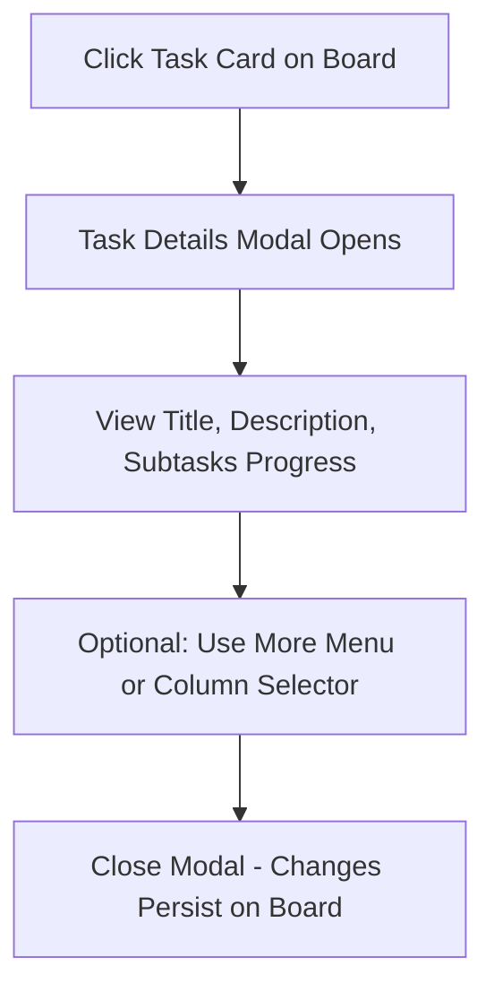

Task Details and Subtasks allow you to dive deeper into individual tasks on your board, view and edit descriptions, track progress through subtasks, complete them via checkboxes, and move tasks between columns. This feature helps you manage task granularity and workflow progression without leaving the board view, providing a clear overview of completion status and quick actions for updates.

## 7.1 Viewing Task Details

Clicking on any task card in a column opens a modal window displaying comprehensive details. This modal overlays the board and focuses solely on the selected task.

### What You See in the Task Details Modal
- **Task title**: Displayed prominently at the top in large, bold text.
- **More options menu** (vertical dots icon): Positioned to the right of the title; clicking it reveals a dropdown popup with **Edit Task** and **Delete Task** options.
- **Description**: A paragraph below the title showing the task's details. If no description exists, it shows *No description*.
- **Subtasks** section: A bold label like *Subtasks (3 of 5)* indicating completed out of total subtasks, followed by a scrollable list (if 4 or more subtasks, it has a fixed height with padding).
- **Column** section: A bold label followed by a dropdown selector showing the current column name.

| Element | Description | Interaction |
|---------|-------------|-------------|
| **Task title** | The name of the task as created. | Read-only; use menu to edit. |
| **Description** | Full text details of the task. | Read-only; use **Edit Task** to change. |
| **Subtasks (X of Y)** | Progress counter where *X* is completed subtasks and *Y* is total. Updates live. | Read-only label; subtasks below are interactive. |
| **More options menu** | Vertical dots button. | Click to open popup; select **Edit Task** to open edit form or **Delete Task** to confirm removal. |
| **Column dropdown** | Shows current column (e.g., *To Do*); lists all available columns. | Select a new column to move the task instantly. |

### Opening Task Details
1. Navigate to your board via the sidebar 3.1. Sidebar Board List.
2. Locate the task card in its column; it shows the title and a subtasks progress like *2 of 4 subtasks*.
3. Click anywhere on the task card to open the details modal.

### Expected Results
- Modal appears centered over the board.
- Task remains draggable on the board but details are accessible anytime via re-clicking.
- Changes (e.g., column move) update the board view immediately upon modal close.

> [!NOTE]  
> Task cards show a preview progress (*X of Y subtasks*) even before opening details, linking directly to 7.2. Managing Subtasks.

### Error Handling
- If a task has no subtasks, the section shows *Subtasks (0 of 0)* with an empty list.
- Modal closes via backdrop click or **Close** (handled by outer controls); no unsaved data loss occurs as changes save live.

## 7.2 Managing Subtasks

Subtasks are nested items within a task, each with a title and completion status. Use checkboxes to mark them done, updating the progress counter live. This integrates with task-level progress visible on cards and in details.

### Subtask List Elements
Each subtask appears as a row with:
- A **checkbox** (checked if complete).
- **Title** text (strike-through if complete).

| Field | What It Represents | Required? | Format/Values | Behavior on Change |
|-------|--------------------|-----------|---------------|--------------------|
| **Checkbox** | Completion status (*checked* or *unchecked*). | No | Toggle only. | Marks subtask complete/incomplete; updates *Subtasks (X of Y)* counter instantly; strike-through applies to title. |
| **Title** | Name of the subtask. | Yes (set on creation) | Text string. | Read-only in details; strike-through visual when checked. |

### Completing or Reopening Subtasks
1. Open task details 7.1. Viewing Task Details.
2. In the subtasks list, click the **checkbox** next to a subtask title.
3. The checkbox toggles, title strike-through appears/disappears, and progress updates (e.g., *Subtasks (2 of 5)* → *Subtasks (3 of 5)*).

### Moving Tasks Between Columns
1. In task details, scroll to the **Column** section.
2. Click the dropdown selector.
3. Choose a new column from the list (populated from board columns 5. Managing Columns).
4. Task moves to the selected column on the board; modal can close or stay open.

### Editing or Deleting the Task
1. Click the **More options menu** (vertical dots).
2. Select **Edit Task**: Opens an edit form modal pre-filled with current details (links to 6. Creating and Managing Tasks for editing workflow).
3. Select **Delete Task**: Opens a confirmation dialog showing the task title; confirm to remove the task and all subtasks permanently, or cancel.

> [!WARNING]  
> Deleting a task removes it and all subtasks irreversibly. Use column moves or archiving if unsure.

### How It Connects to Other Features
- Task cards on the board 6. Creating and Managing Tasks preview subtask progress, driving users here for details.
- Column changes interact with 5. Managing Columns; tasks can be dragged between columns as an alternative.
- Editing opens the same form as task creation, maintaining consistency.

### Expected Outputs
- Checkbox toggle: Immediate progress update in modal and on task card.
- Column change: Task visually relocates; board refreshes.
- Delete: Task vanishes from board; confirmation message in dialog.

| Action | Result on Board | Result in Modal |
|--------|-----------------|-----------------|
| Toggle subtask | Task card progress updates (e.g., *3 of 5*). | Counter and strike-through update live. |
| Change column | Task appears in new column. | Selector reflects new value. |
| Edit | Modal switches to edit form. | N/A (new modal). |
| Delete | Task and subtasks gone. | Confirmation dialog, then closes. |