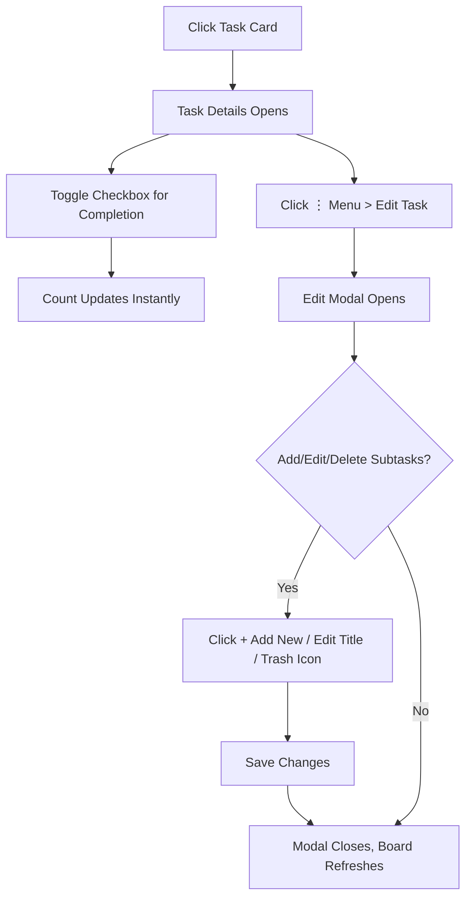

Subtasks allow you to break down larger tasks into smaller, actionable items within a task. This helps track progress at a granular level, with visual indicators for completion status and counts. You can toggle subtasks as complete directly in the task details view or manage them (add, edit titles, delete) through the task edit modal. Managing subtasks ensures tasks reflect real progress and integrates seamlessly with task movement across columns.

## Viewing Subtasks
Subtasks appear in two places:
- **Task cards** on the board show a summary count at the bottom, such as *0 of 3 subtasks*, indicating completed out of total.
- **Task details modal** displays the full list when you click a task card.

To view subtasks:
1. Navigate to a board via the sidebar.
2. Click any **task card** in a column to open the **task details modal**.
3. Scroll to the **Subtasks** section, which shows:
   - A header with the count, e.g., *2 of 4 subtasks*.
   - A scrollable list (if more than 4 subtasks) of each subtask as a row with a **checkbox** on the left and the *title* on the right.
   - Completed subtasks have a **checkmark** in the checkbox and *strikethrough text*.

> [!NOTE]
> If no subtasks exist, the count shows *0 of 0 subtasks*, but new tasks require at least one subtask.

## Toggling Subtask Completion
Toggle completion to mark progress without editing the task. Changes update instantly across the board.

1. Open the **task details modal** by clicking a **task card**.
2. In the **Subtasks** section, click the **checkbox** next to any subtask title.
   - **Checked** (completed): Adds strikethrough to the title; count updates (e.g., *1 of 3 subtasks*).
   - **Unchecked** (incomplete): Removes strikethrough; count decreases.
3. The board refreshes automatically; task cards reflect the new count.
4. Close the modal by clicking the **X** or outside it.

> [!WARNING]
> Toggling only affects completion status, not the subtask title or order. Use the edit modal for those changes.

## Adding Subtasks
Add subtasks when creating or editing a task. At least one subtask is required for every task.

1. Open the **task edit modal**:
   - From a **task card**: Click it to open details, then click the **vertical dots menu** (⋮) > **Edit Task**.
   - Or create a new task via **+ Add Task** in a column.
2. Scroll to the **Subtasks** section.
3. Click **+ Add New Subtask**.
   - A new blank row appears with an editable **title field**.
4. Fill in the **title** (text, at least 1 character).
5. Repeat to add more.
6. Click **Save Changes** (or **Create Task** for new tasks).

Expected result: Subtasks appear in the task details and update counts on task cards.

## Editing Subtasks
Edit subtask titles or delete them via the task edit modal. Completion status resets to incomplete on edits.

| Field  | Description                  | Required | Accepted Values          | Default |
|--------|------------------------------|----------|--------------------------|---------|
| Title | The name of the subtask (e.g., "Update logo") | Yes     | Text, minimum 1 character | Blank  |

1. Open the **task edit modal** as described above.
2. In **Subtasks**:
   - Click into the **title field** of any subtask to edit.
   - Use the **delete icon** (trash bin) next to a subtask to remove it.
3. Ensure at least one subtask remains with a valid title.
4. Click **Save Changes**.

Error messages:
- *Required*: Appears under a blank **title field** if empty.
- *Add a subtask*: Shown if no subtasks exist when saving.
- Changes validate on save; invalid forms prevent closing with unsaved data.

## Subtask Workflow

## Related Features
- Subtasks require tasks: See 6.1. Adding Tasks and 7.1. Viewing Task Details.
- Drag tasks (with subtasks) between columns: Counts and completion persist.
- Board-wide changes: Editing subtasks updates the active board only.